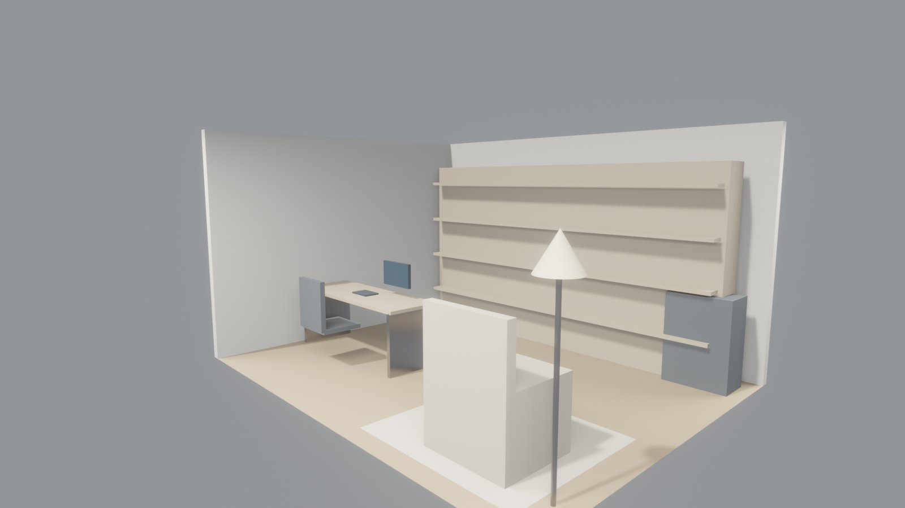
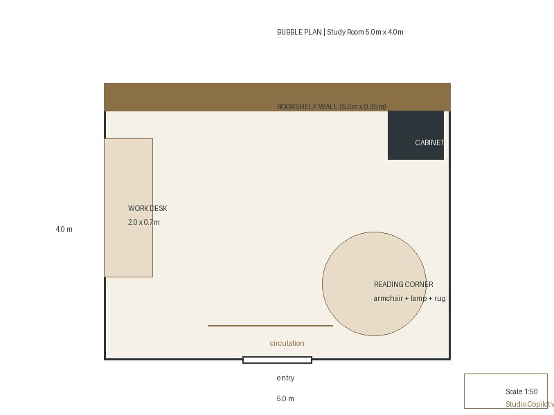
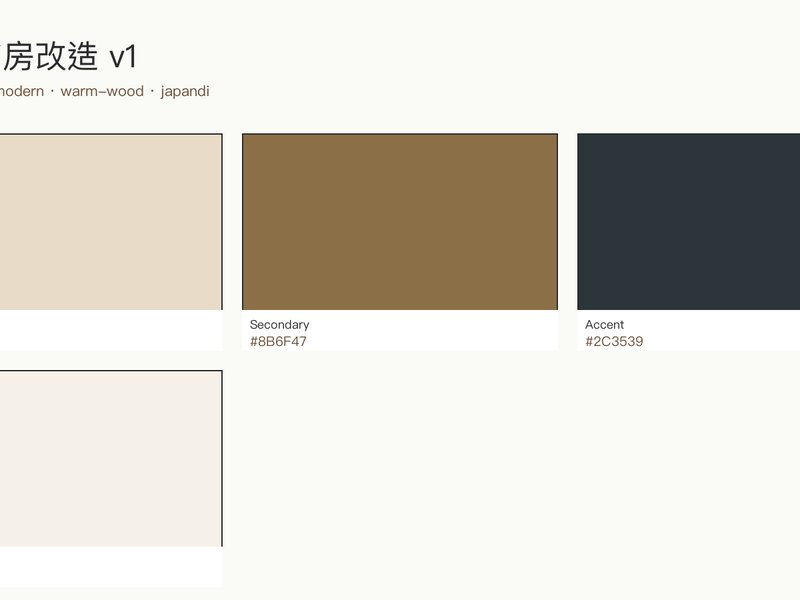
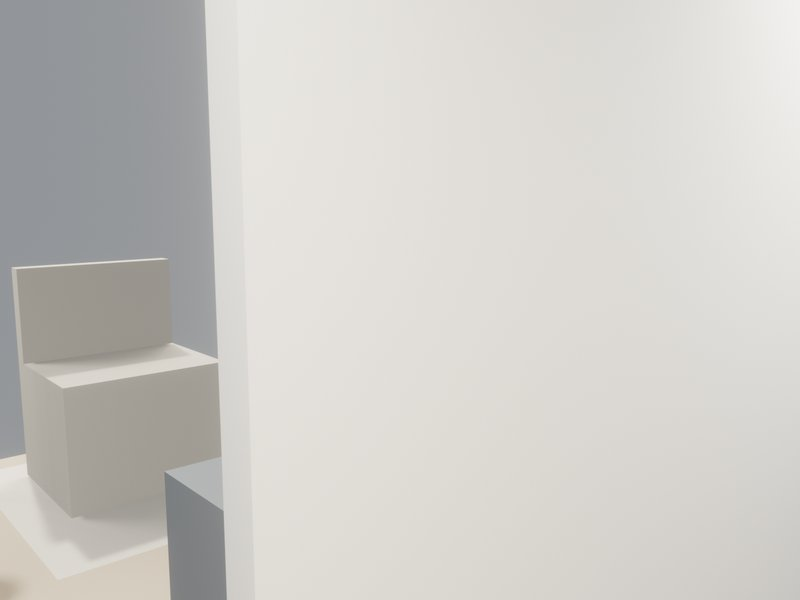

# 极简书房改造 v1

## 核心指标

| 面积 | 造价 | EUI | 合规 |
|:-:|:-:|:-:|:-:|
| — | HK$ 253,658 | 41.2 kWh/m²·yr | 7/8 (HK) |

## 方案亮点

书桌沿窗而立，日系 japandi 语境下阅读动线从入口直抵长书架。minimalist 取舍压掉多余层次，只留暖木饰面与白墙两种底色。窗角阅读位以自然光为界，午后斜光落在桌面。入夜后暖光灯与木纹交错，书房从白日的工作桌自然过渡成夜晚的独处角落。

## 作品展示

**1.** 

**2.** 

**3.** 

**4.** 

## 交付清单

- 3D 模型 · 0 件套（）
- 图纸 · 1 张平面 · 0 立面 · 0 剖面
- 8 份角色定制方案书
- Blender scene: 21 objects · IFC4 products: 0

[联系我们 · 要类似方案 →](mailto:studio@example.com?subject=01-study-room)
