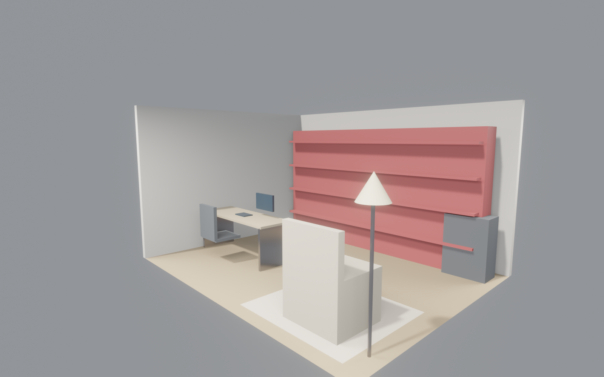
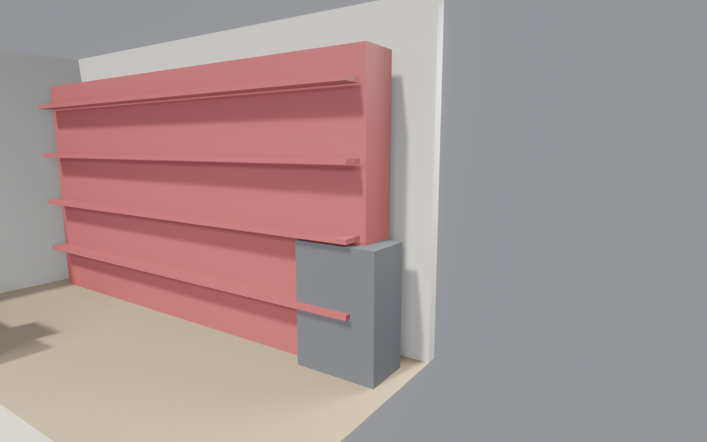
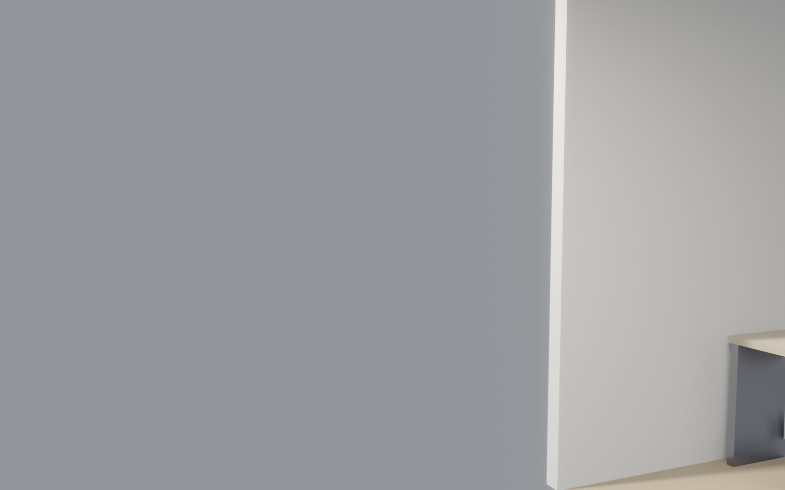

<!-- _class: lead client -->

# 极简书房改造
## 20 m² · Japandi 风格 · v1
### 给 张先生 的方案介绍

 

| 设计周期 | 方案版本 | 决策点 |
|---|---|---|
| 9 分 29 秒 | v1 | 4 个 |

---

<!-- _class: split client -->

## 风格定调 · Japandi
- **关键词**：极简 / 温润木色 / 东方克制
- **主色**：米白 #E8DCC8 · 橡木 #8B6F47 · 炭黑 #2C3539
- **感觉**：日光下像一间有书卷气的工作室，晚上灯亮像一间茶室
- **为什么选这个**：耐看、不过时，和家里其它空间自然衔接

---

<!-- _class: split client -->

## 第一眼印象
- 推门进来：整面白橡木书墙直接撞入视线
- 暖色吊灯 + 羊毛地毯 + 亚麻沙发，像一间私人图书室
- 20 m² 虽不大，但层高 2.8 m，视觉拉升很明显

---

<!-- _class: split client -->

## 核心：书墙 · 容量 500 册
- **尺寸**：宽 5.0 m × 高 2.8 m，整面占满背墙
- **分层**：4 层开放格 + 底部带门柜（隐藏收纳，杂物不外露）
- **材质**：白橡木多层板，原木色封边
- **细节**：每层留 40 cm 高，A4 文件 / 大画册都能竖着放

---

<!-- _class: split client -->

## 工作桌 · 可容双屏
- **尺寸**：1.4 × 0.7 m，刚好放 27" 显示器 + 笔记本 + 资料摊开
- **桌面**：白橡木台面，黑钢脚架（japandi 常见搭配）
- **朝向**：面西，下午自然采光，工作时不直射眼睛
- **决策点**：要不要加一个抽屉组？（¥800，放耗材）

---

<!-- _class: split client -->

## 阅读角 · 单人沙发 + 落地灯
- **沙发**：米白亚麻，包裹性强，可半躺读一下午
- **落地灯**：黄铜杆 + 亚麻灯罩，3000K 暖光
- **地毯**：1.5 × 1.2 m 羊毛地毯，冬天赤脚舒服
- **细节**：沙发旁留 30 cm 空隙，可放小边几或茶杯

---

<!-- _class: split client -->

## 隐藏收纳 · 带门柜
- **位置**：书墙右下角一组独立带门柜
- **尺寸**：0.7 × 0.5 × 1.0 m（宽×深×高）
- **用途**：放打印机 / 文件档案 / 不想外露的杂物
- **门板**：炭黑色哑光，和工作椅呼应

---

<!-- _class: split client -->

## 平面图 · 动线
- **书墙**：北墙整面 · 最主要的视觉焦点
- **工作桌**：西侧，靠窗（自然采光）
- **阅读角**：东南角，带地毯围出独立感
- **走道**：中间 1.2 m 通行宽度，进出不挤

---

## 请你决定的 4 件事

| # | 决策项 | 选项 | 影响 |
|---|---|---|---|
| 1 | **书墙顶部开放 or 到顶** | 到顶显高 / 留 30 cm 喘息 | 容量 vs 视觉 |
| 2 | **书柜门板颜色** | 同色白橡木 / 炭黑对比 | 整洁 vs 层次 |
| 3 | **地板材质** | 橡木多层（¥600/m²）/ 更高端纯实木（¥1200/m²） | 预算差 ¥12K |
| 4 | **沙发换单椅？** | 亚麻沙发 / 皮质单椅 | 氛围差别 |

---

## 预算 + 工期

¥78K
主材+施工

6 周
从拆到入住

20
m² 整屋

**主要花费**：书墙 ¥22K · 地板 ¥12K · 墙漆 ¥3.2K · 工作桌椅 ¥6.5K · 阅读角 ¥5.8K · 储物柜 ¥4.5K · 软装 ¥6.4K · 水电安装 ¥18K

---

<!-- _class: lead client -->

# 下一步

> ✅ 方案已就绪 · ⏭ 等你反馈

- **微调**（颜色/数字）→ 5 分钟出新版本
- **重排**（家具/分区）→ 10 分钟
- **换风格**（整套配色）→ 20 分钟

反馈后进入施工图深化 → 招标 → 开工
