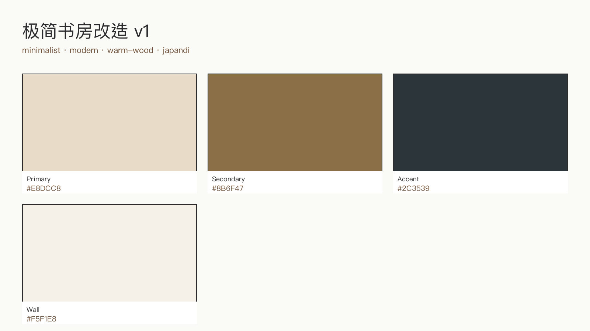
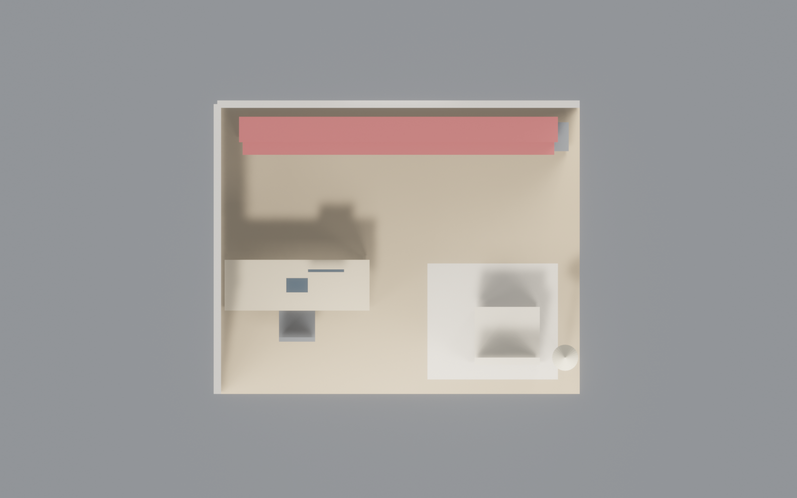
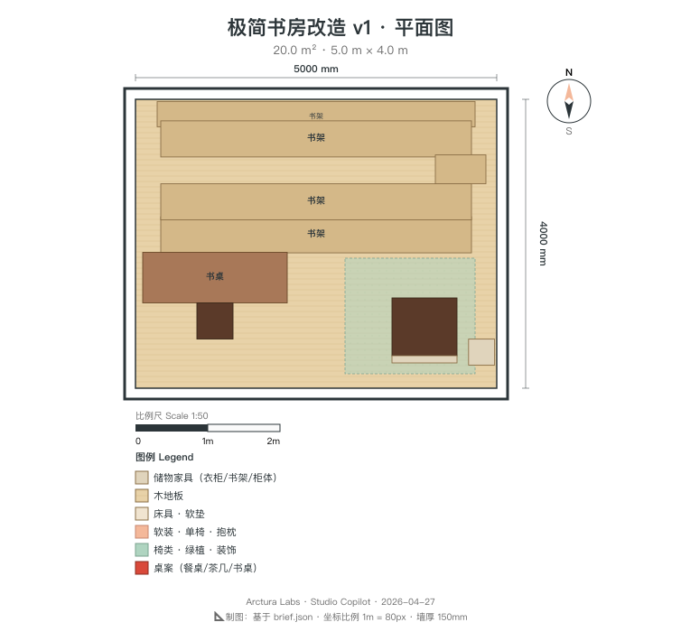
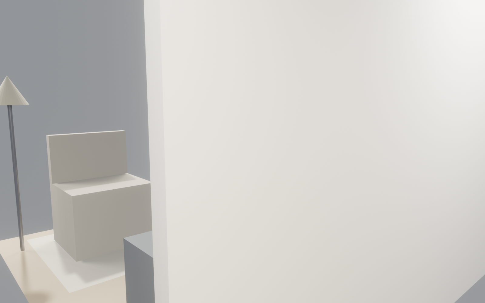
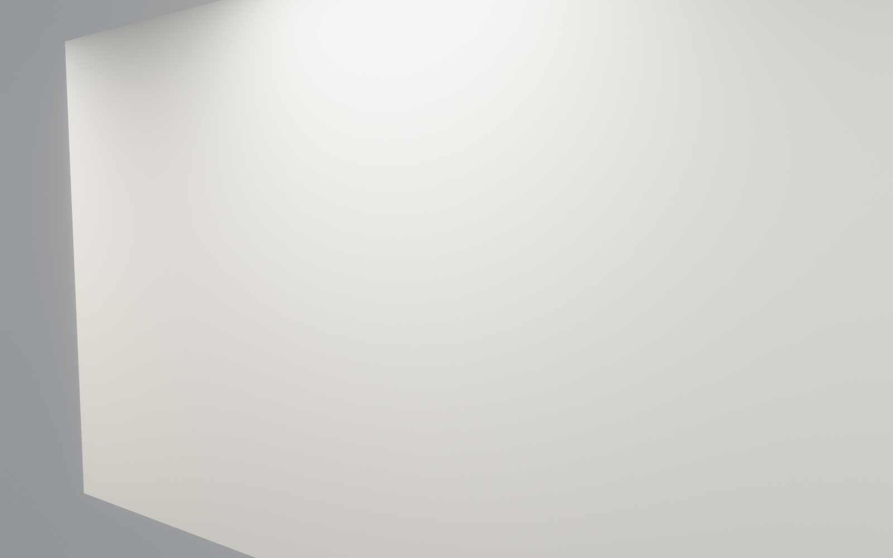

<!-- _class: lead designer -->

# 极简书房 · 深化设计交付包
## 20 m² Japandi · v1 源文件清单
### 给 设计师同事 的技术交底

<br>

| 场景版本 | 物件数 | 材质数 |
|---|---|---|
| v1 | 21 | 9 |

---

## 源文件清单

| 文件 | 用途 | 工具 |
|---|---|---|
| `brief.json` | 需求原始输入（预算/风格/需求） | 人类可读 |
| `room.json` | 3D 场景（21 物件 / 9 材质 / 相机 / 灯光） | blender-cli |
| `moodboard.json` | 配色板（4 色 swatch） | gimp-cli |
| `floorplan.svg` | 2D 平面矢量，可 Inkscape 直接改 | inkscape-cli |
| `boq.lo-cli.json` | BOQ 明细（9 项 ¥78K） | libreoffice-cli |
| `renders/0[1-8]*.png` | 8 张多角度渲染 | _render_multi.py |
| `decks/deck-*.md` | 8 套 stakeholder PPT | marp |

---

<!-- _class: split designer -->



## 配色码 · Japandi v1
```
Primary    #E8DCC8   米白（主色/墙面辅）
Secondary  #8B6F47   橡木（书墙/桌面）
Accent     #2C3539   炭黑（金属件/椅子/柜门）
Wall       #F5F1E8   主墙面漆（略比 primary 更亮）
```
- 4 色 palette 可在 `moodboard.json` 调整
- 任一色变更 → `moodboard.png` 重出 → 所有 deck 自动换色

---

<!-- _class: split designer -->



## 平面图（俯视渲染）
- **尺寸**：5.0 m × 4.0 m × 2.8 m（L×W×H）
- **物件数**：21 个
- **材质数**：9 种（全 principled BSDF）
- **用途**：客户 / 营销首选，比纯线图更直观

---

<!-- _class: split designer -->



## 平面图（标注 SVG）
- `floorplan.svg` Inkscape 打开可直接编辑
- `floorplan.inkscape-cli.json` 记录所有 shape 坐标
- 导出：`rsvg-convert -d 150 floorplan.svg -o floorplan.png`
- 适合施工方审图 / 家具摆位确认

---

## 材质表 · PBR 参数（principled BSDF）

| ID | Name | Color | Roughness | Metallic | 用途 |
|---|---|---|---|---|---|
| 0 | WoodFloor | #8C6B47 | 0.55 | 0.00 | 地板 |
| 1 | Wall | #EBE1D2 | 0.90 | 0.00 | 墙面 |
| 2 | LightWood | #BF9E73 | 0.60 | 0.00 | 书墙/桌面 |
| 3 | Charcoal | #2E3338 | 0.60 | 0.05 | 椅子/柜门 |
| 4 | Rug | #D1BFA6 | 0.95 | 0.00 | 地毯 |
| 5 | Fabric | #C7B394 | 0.98 | 0.00 | 沙发 |
| 6 | Metal | #595A61 | 0.30 | 0.95 | 桌腿/灯杆 |
| 7 | Shade | #F2D9A6 | 0.70 | 0.00 | 灯罩 |
| 8 | Screen | #0C1A26 | 0.30 | 0.20 | 笔记本/显示器 |

---

## 关键尺寸（物件级）

| 物件 | 尺寸 (m) | 位置 (x,y,z) | 备注 |
|---|---|---|---|
| 书墙整体 | 4.4 × 0.35 × 2.4 | (0, 1.65, 1.2) | 4 层搁板 + 底柜 |
| 搁板（×4） | 4.3 × 0.5 × 0.04 | z=0.5/1.05/1.6/2.15 | 层高 55 cm |
| 工作桌 | 2.0 × 0.7 × 0.04 | (-1.4, -0.5, 0.75) | 黑钢脚架 |
| 工作椅 | 0.5 × 0.5 × 0.9 | (-1.4, -1.0, 0.45) | 炭黑皮革 |
| 阅读沙发 | 0.9 × 0.8 × 0.7 | (1.5, -1.2, 0.35) | 亚麻包覆 |
| 落地灯 | Ø0.36 × 1.7 | (2.3, -1.5, 0.85) | 黄铜杆+亚麻罩 |
| 羊毛地毯 | 1.8 × 1.6 | (1.3, -1.0, 0.005) | 阅读角下 |
| 储物柜 | 0.7 × 0.4 × 1.0 | (2.0, 1.55, 0.5) | 炭黑带门 |

---

## 灯光规划

| Light | Type | 位置 | Power | Color | 用途 |
|---|---|---|---|---|---|
| Sun | SUN | — | 3.0 | (1.0, 0.95, 0.85) | 模拟窗光 |
| Area | AREA 1×1 m | (0, -1.5, 2.6) | 100 | (1.0, 0.95, 0.85) | 顶棚主光 |
| Point | POINT r=0.25 | (2.3, -1.5, 1.7) | 60 | (1.0, 0.8, 0.5) | 落地灯发光 |

**现实映射**：顶灯 3000K 面板 + 落地灯 2700K 暖光球泡 + 工作桌局部 4000K 台灯（v1 未建模，可加）

---

<!-- _class: split designer -->



## 书墙深化要点
- **结构**：5.0 m 跨度需中间至少 1 个立柱（物件 id=3 BackPanel 为整块需拆）
- **搁板承重**：每层 50 kg（满书容量）→ 白橡木多层 25 mm + 金属 L 角
- **底柜门**：炭黑哑光（Charcoal material），可选磁吸 push-to-open
- **背板开槽**：留 1 条 40 mm 宽缝走桌面下的线材（隐藏走线）

---

<!-- _class: split designer -->



## 阅读角深化要点
- **落地灯**：黄铜杆 Ø24 mm · 底座 Ø250 mm 配重 · LED 9W 2700K（可调光）
- **地毯**：100% 羊毛 / 平织 / 1800×1600 mm（room.json 是 1.5×1.2 m，可放大）
- **沙发**：可替换为单椅（决策点 #4）→ 改 room.json 物件 13-14 → 重渲
- **边几建议**：v1 未建模，留 30 cm 空隙建议加一小边几（¥1200）

---

## 如何修改 · 工作流

```bash
# 改 3D 物体（挪家具 / 换材质）
vim room.json
python _render_multi.py  # 重渲染 8 张

# 改 2D 平面（标注 / 尺寸线）
inkscape floorplan.svg
rsvg-convert -d 150 floorplan.svg -o floorplan.png

# 改 PPT（文字 / 数字）
vim decks/deck-*.md
bash scripts/build_pptx.sh .

# 改配色
vim moodboard.json
python scripts/gen_moodboard.py
```

---

## CLI 工具链

| 工具 | 作用 | 文档 |
|---|---|---|
| blender-cli | headless 3D 渲染 + IFC4 导出 | CLI-Anything/blender |
| inkscape-cli | SVG 编辑 + DXF 导出 | CLI-Anything/inkscape |
| libreoffice-cli | Impress/Calc 编辑 | CLI-Anything/libreoffice |
| gimp-cli | moodboard 生成 | CLI-Anything/gimp |
| marp-cli | MD → PPTX | `npm i -g @marp-team/marp-cli` |
| Pascal Editor | 3D 建筑建模 | CLI-Anything/Pascal |

---

<!-- _class: lead designer -->

# 下一步

> 你来深化哪个区？

- **书墙节点大样** → 我出 1:20 立面
- **照明重排** → 告诉我氛围（读书 / 工作 / 休闲主导）
- **替换家具** → 给我 SKU，我重跑 room.json
- **加窗 / 门** → 当前 v1 仅 3 面墙，另 1 面留给现场

→ 选哪个，2 小时内出深化包
