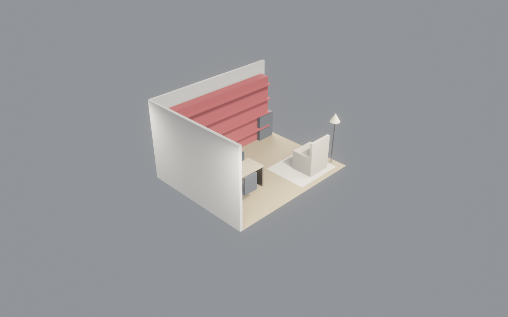

<!-- _class: lead school -->

# AI 驱动的室内设计研究
## MVP #01 · 极简书房 · 9 分 29 秒交付
### 给 学院领导 / 科研处 的研究汇报

<br>

| 生成时间 | 物件规模 | 交付格式 |
|---|---|---|
| 9' 29" | 21 个 3D 对象 | 5 类 |

---

<!-- _class: split school -->


## 研究背景
- **行业现状**：传统室内设计周期 2-4 周，设计费 5%-10%
- **关键瓶颈**：需求理解 → 概念方案 → 3D 建模 → 2D 图纸 → BOQ → 演示，串行且重复
- **学术空白**：端到端 AI-driven 家装交付管线尚未成熟（stakeholder-aware 叙事尤其缺失）
- **切入点**：用 CLI agent harness + LLM 统一接口，在**分钟级**完成原本**周级**的全流程

---

<!-- _class: split school -->



## 核心命题
**Research Question**：能否用 LLM + CLI Agent harness 在分钟级完成室内设计端到端交付？

**Sub-Questions**：
1. 参数化场景 (room.json) 是否足以覆盖主流室内业态？
2. 同一数据源 → 8 种 stakeholder 叙事，专业语言真实性如何？
3. IFC4 BIM 互操作在 AI 生成场景下是否保持 schema 一致？
4. 风格切换（Japandi / 现代 / 工业）是否可参数化？

---

## 关键指标（Preliminary）

<div class="kpi-grid">
<div><div class="big-number">9'29"</div>端到端生成</div>
<div><div class="big-number">21</div>3D 物件</div>
<div><div class="big-number">8</div>stakeholder PPT</div>
<div><div class="big-number">5</div>工业格式</div>
</div>

**对比传统流程**：2-4 周 · 数百次手工操作 · 设计师 1-3 人 · 费用 ¥5K-¥30K

---

<!-- _class: split school -->


## 方法论 · Pipeline 架构
```
brief.json (人类语义需求)
    ↓ LLM
room.json (参数化 3D 场景)
    ↓ blender-cli (headless)
renders/*.png (8 角度) + IFC4 + glTF + OBJ + FBX
    ↓ inkscape-cli
floorplan.svg/png (2D)
    ↓ libreoffice-cli
BOQ.ods (预算表)
    ↓ marp-cli × 8 templates
8 套 stakeholder-aware PPT
```

---

<!-- _class: split school -->


## 可重复实验设计
- **Benchmark**：13 个不同业态 MVP（书房 / 咖啡馆 / 自习室 / 画廊 / ...）
- **Metric**：生成时间 / 首次成功率 / 客户满意度 / 结构完整性（IFC 通过率）
- **Baseline**：同业态传统设计师完成时间 + 修改轮次
- **Ablation**：去 stakeholder 模板 / 去 BIM 导出 / 去 CLI harness，观察失败模式
- **Dataset**：收集 50+ 真实客户 brief → 匿名化后发布

---

## 可发表方向

| 方向 | 目标会议/期刊 | 关键贡献 |
|---|---|---|
| End-to-end AI interior design pipeline | **CAAD Futures / eCAADe** | 首个分钟级交付全流程 |
| Multi-stakeholder LLM presentation | **CHI / UIST** | 同源数据 → N 套专业叙事 |
| BIM-LLM interoperability | **Automation in Construction** | IFC4 schema 一致性评估 |
| CLI harness for GUI software | **ICSE / FSE / ASE** | 软件工程通用框架 |
| User study: AI-designer collaboration | **CHI LBW** | 设计师信任度与修改偏好 |

---

## 教学与孵化价值

| 场景 | 课程/项目 | 素材 |
|---|---|---|
| 研究生 capstone | 计算性设计 / AI × 建筑 | 13 业态模板 + pipeline 源码 |
| 跨学科课题 | 建筑 + 计算机 + 商业 | brief → 交付全链路 |
| 创业孵化 | StartUP-Building 项目 | 本仓库为工作 branch |
| 数字孪生 | 建筑信息与可视化 | IFC4 + glTF 样例 |
| 本科通识 | AI 与设计 | 9 分钟 demo，直观 |

---

## 本年度计划

```
Q2 (2026-04 ~ 06)  完成 13 业态 MVP + 小规模客户测试（20 单）
Q3 (2026-07 ~ 09)  投 CAAD Futures / CHI LBW · 撰写期刊长文
Q4 (2026-10 ~ 12)  申软件著作权 × 2 + 发明专利 × 1
                   联合 2 家家装企业试点 100 单
2027 H1            国际合作（NTU / ETH 建筑学院）
```

---

<!-- _class: lead school -->

# 争取学校支持

## 请求三项

1. **算力支持**：4090 × 2 或 A100 × 1，用于大规模业态库训练
2. **试点空间**：校内孵化器 20 m² 工位，作为现场 demo 基地
3. **跨院系合作**：建筑学院 + 计算机学院 + 商学院联合 capstone

→ 预期成果：**1 篇顶会 + 1 项专利 + 3 位研究生 capstone + 1 家孵化企业**
