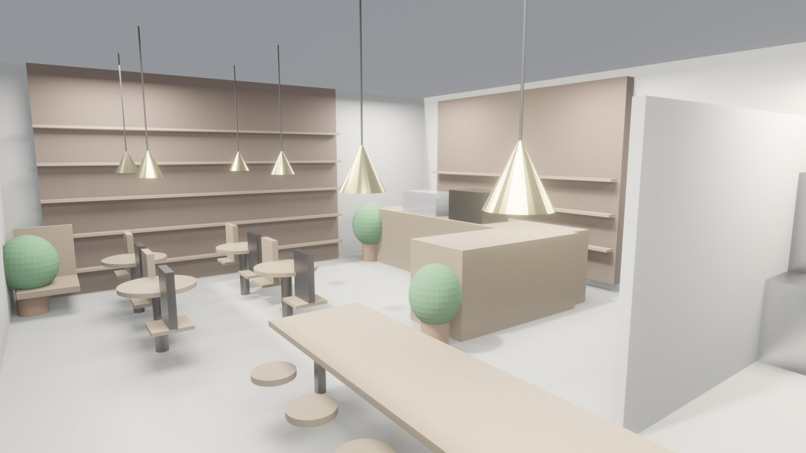
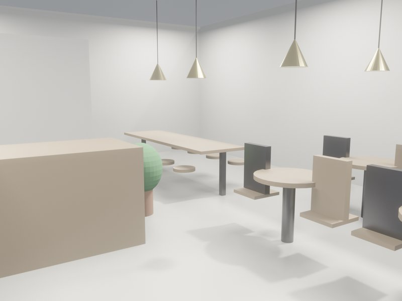
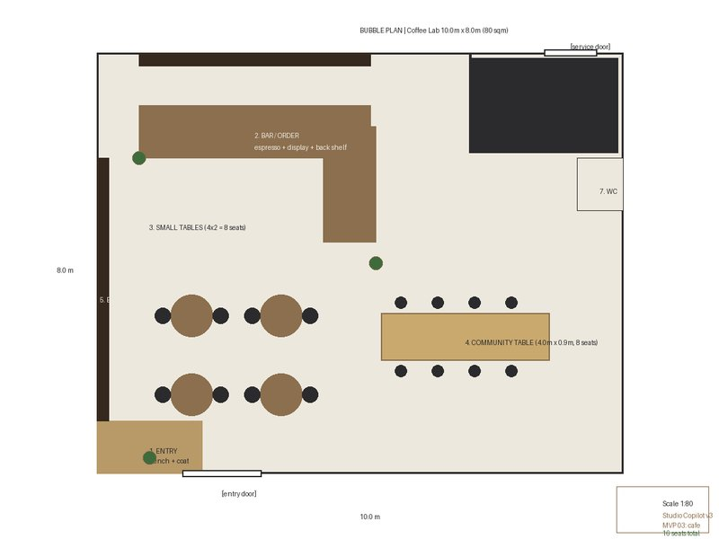
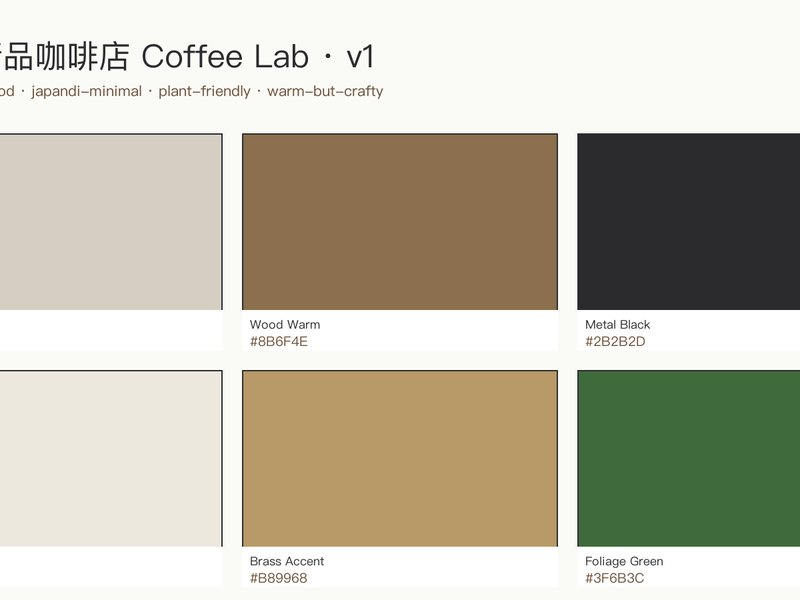

# 独立精品咖啡店 Coffee Lab · v1

## 核心指标

| 面积 | 造价 | EUI | 合规 |
|:-:|:-:|:-:|:-:|
| 80 m² | HK$ 894,200 | 130.5 kWh/m²·yr | 7/8 (HK) |

## 方案亮点

80 m² 临街商铺，industrial-wood 与 japandi-minimal 相互缓冲。吧台后墙 4m 长书架成为视觉焦点，散座区围绕吧台呈半环形展开，长桌区贴墙而立留出 plant-friendly 角落。后厨独立出入，不穿越客区。午后阳光透过临街玻璃落到书架上，咖啡香气与纸页气味在店内交错。

## 作品展示

**1.** 

**2.** 

**3.** 

**4.** 

## 交付清单

- 3D 模型 · 5 件套（DXF / FBX / GLB / IFC / OBJ）
- 图纸 · 1 张平面 · 0 立面 · 0 剖面
- 8 份角色定制方案书
- Blender scene: 78 objects · IFC4 products: 82

[联系我们 · 要类似方案 →](mailto:studio@example.com?subject=03-coffee-shop)
