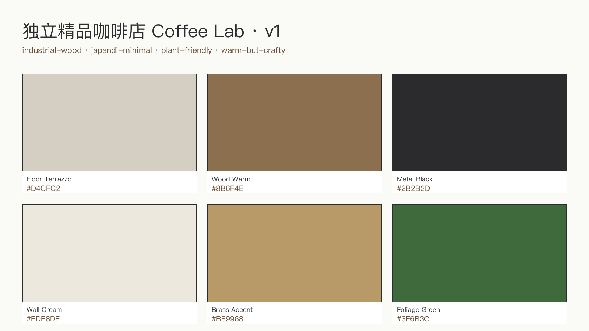

<!-- _class: lead client -->

# Coffee Lab
## 独立精品咖啡店 80 m² · v1
### 给主理人的方案介绍

 

| 设计周期 | 方案版本 | 待决策点 |
|---|---|---|
| 9 分 29 秒 | v1 | 4 项 |

---

<!-- _class: split client -->

## 风格定调
- **三个关键词**：industrial-wood · japandi-minimal · plant-friendly
- **6 色基调**：奶油白墙 + 暖胡桃木 + 黑铁 + 水磨石地 + 黄铜点缀 + 绿植
- **对标品牌**：% Arabica / Blue Bottle / Fuglen
- 暖但不腻，像朋友家客厅

---

<!-- _class: split client -->

## 第一眼印象
- 推门即见 **4 米长书架墙** 作为视觉锚点
- 8 米临街面 + 落地玻璃 → 街上能看进来、里面能看出去
- 黄铜吊灯 2700K 暖光，天黑后最出片
- 整体给人：**想进来坐下**

---

<!-- _class: split client -->

## 吧台 · 点单动线
- **L 型吧台** 14 m²：点单 → 取杯 → 离开，单向不拥堵
- La Marzocco 咖啡机 + 展示冷柜摆在客人视线内
- 咖啡师操作即"表演"，人就是装修的一部分
- 高峰期 2 咖啡师同时不撞手

---

<!-- _class: split client -->

## 散座区 · 30+ 稳定座位
- **4 × 圆木桌 + 8 椅**：情侣/小聚的理想尺度
- **1 × 4m 长桌 + 8 长凳/高脚凳**：独坐办公/陌生人拼桌
- 书架墙贯穿背景，随手翻本书就是社媒素材
- 合计 30+ 座位，符合必含项

---

<!-- _class: split client -->

## 绿植 + 书架 · 氛围点
- **3 个落地大型盆栽**，分散在角落增加柔度
- 4 米 × 5 层书架可放书、可放陈列品（豆袋/器具）
- 自然光从临街面打进来，午后最好的光
- 这里是"拍照第一位"的角落

---

<!-- _class: split-1to2 client -->

## 彩色平面 · 一眼看懂
- 入口 → 吧台 → 座位 → 后厨，**动线不交叉**
- 出入口 ≥ 2（前门 + 后厨应急门），符合消防
- 后厨 12 m² 独立，客人看不到切菜洗碗
- 卫生间入口在侧边隐蔽位

---

## 4 个决策点

| # | 决策项 | 选项 A | 选项 B | 成本差 |
|---|---|---|---|---|
| 1 | 临街玻璃 | 通透落地 | 半高木框 | ±¥8K |
| 2 | 吧台材质 | 黑铁 + 水磨石面 | 全胡桃木 | ±¥12K |
| 3 | 座位密度 | 30 座（宽松） | 36 座（拥挤但翻台更高） | 无硬成本 |
| 4 | 书架墙 | 纯展示 | 部分可售周边 | ±¥5K |

---

## 预算 + 工期

| 分项 | 金额 ¥ | 占比 |
|---|---|---|
| 硬装（拆改/水电/吊顶/地面） | 180,000 | 40% |
| 吧台 + 后厨设备 | 120,000 | 27% |
| 家具软装（木桌椅/沙发/书架） | 80,000 | 18% |
| 照明 + 电器 | 40,000 | 9% |
| 绿植 + 陈设 + 预留 | 30,000 | 6% |
| **合计** | **¥450,000** | **8 周** |

---

<!-- _class: lead client -->

# 下一步

> 方案已就绪 · 等你反馈

- **微调**（颜色/桌数） → 5 分钟出新版
- **重排**（吧台/座位区位置） → 10 分钟
- **换风格**（整套配色） → 20 分钟

联系：Studio Copilot Team
