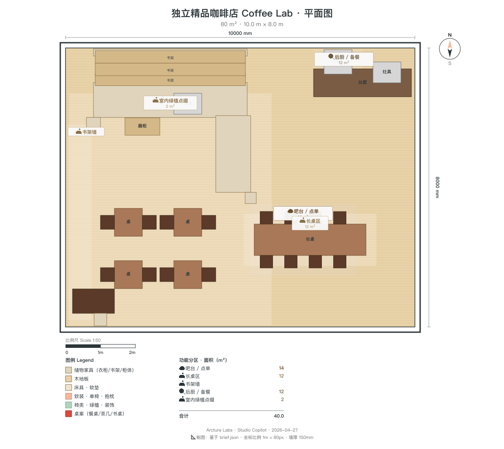

<!-- _class: lead contractor -->

# Coffee Lab
## 施工交付包 · v1
### DXF + IFC4 + 节点详图 · 8 周可开业

---

<!-- _class: split-1to2 contractor -->

## 平面图 · 分区与尺寸
- **总尺寸** 10.0 × 8.0 × 3.5 m (L × W × H)
- 临街面 8.0 m（东向），带独立出入门
- 8 功能区 · 后厨独立门 · 卫生间独立入口
- **出入口 ≥ 2**（前门 + 后厨应急）符合消防

---

<!-- _class: split-1to2 contractor -->

## DXF 施工图
- `exports/floorplan.dxf`（61 KB, ~80 实体）
- 1:80 比例，AutoCAD / Rhino / QCAD 直接打开
- 所有墙体/门洞/家具位已在图上
- 另附 `exports/cafe.ifc` · Revit / ArchiCAD 导入

---

## BOQ 主项汇总

| 分项 | 数量 | 单位 | 金额 ¥ |
|---|---|---|---|
| 拆改 + 砌筑 + 粉刷 | 80 | m² | 45,000 |
| 水电粗装（强弱电/给排水） | 1 | 项 | 55,000 |
| 吊顶 + 地面（水磨石）| 80 | m² | 50,000 |
| 后厨排烟 + 隔油池 | 1 | 项 | 30,000 |
| L 型吧台（含面）定制 | 1 | 项 | 35,000 |
| 后厨设备（冷柜/水槽/操作台）| 1 | 套 | 40,000 |
| La Marzocco 咖啡机 + 磨豆机 | 1 | 套 | 45,000 |
| 家具（桌椅/长凳/高脚凳）| 1 | 套 | 50,000 |
| 书架墙 4m × 5 层定制 | 1 | 项 | 20,000 |
| 照明（吊灯/灯带/筒灯）| 1 | 套 | 35,000 |
| 卫生间洁具 + 隔断 | 1 | 套 | 15,000 |
| 绿植 + 软装 + 预留 | 1 | 项 | 30,000 |
| **合计** | | | **¥450,000** |

---

<!-- _class: split contractor -->

## 关键节点 1 · 吧台 + 后厨
- **吧台面**：水磨石 40 mm 厚，边缘圆角 R5
- **咖啡机位**：220V 16A 专线 · 冷热水 DN15 · 地漏 DN50
- **后厨排烟**：UMC-I 级净化器 + 不锈钢风管 DN200 直通屋顶
- **隔油池**：三级不锈钢 GB 50015 规格，落位后厨门外
- 地面防滑 R10 · 墙面瓷砖 H=1.8 m 以上

---

<!-- _class: split contractor -->

## 关键节点 2 · 书架墙 + 长桌
- **书架结构**：40×40×3 mm 方钢骨架焊接 + 25 mm 胡桃木板
- 墙面预埋 M10 膨胀螺栓 × 12 承重点
- 书架内 **12W/m 灯带 2700K**，DC24V 驱动隐藏在顶层
- **长桌 4m 固定**：三腿钢架落地，提前确定进场通道（最小过道 1.0 m）
- 长凳下方每 2 m 预埋地插 × 1

---

## 照明清单

| 项 | 规格 | 色温 | 数量 |
|---|---|---|---|
| 黄铜吊灯（Menu TR Bulb 或同类）| 8W LED, Ø250 | 2700 K | 6 |
| 吧台后墙线性灯 | 18W/m × 3m | 3000 K | 1 套 |
| 书架内灯带 | 12W/m × 4m | 2700 K | 1 套 |
| 后厨平板灯 | 24W 300×600 | 4000 K | 3 |
| 卫生间筒灯 | 7W Ø75 | 3000 K | 2 |
| 展品射灯 | 5W 轨道 | 3000 K | 4 |
| 应急照明 + 疏散指示 | 国标 | — | 按规范 |

---

## 8 周 Gantt

| 周 | 主要工作 |
|---|---|
| W1 | 拆除、报建（消防+食品卫生许可递交）|
| W2 | 砌筑、墙面基层、水电开槽走管 |
| W3 | 后厨排烟穿墙 + 隔油池开挖 + 瓷砖 |
| W4 | 吊顶龙骨、地面水磨石浇筑、墙面粉刷 |
| W5 | 吧台定制进场、后厨设备进场、灯具安装 |
| W6 | 家具进场、书架焊装 + 木板 + 灯带 |
| W7 | 软装、绿植、咖啡机调试、咖啡师培训、试营业 |
| W8 | 终检、消防/食安复查、正式开业 |

---

## 验收标准

| 项 | 标准 |
|---|---|
| 墙面平整度 | ≤ 3 mm / 2 m 靠尺 |
| 水磨石地面 | 无裂纹 · 防滑 R10 以上 |
| 吧台水槽 | 满水测试 30 min 无渗漏 |
| 排烟管道 | 负压测试 ≥ 80 Pa · 噪音 ≤ 55 dB |
| 隔油池 | 通畅测试 + 油脂分离率 ≥ 85% |
| 照明照度 | 吧台工作面 ≥ 500 lux · 座位区 ≥ 200 lux |
| 电气 | 绝缘 ≥ 0.5 MΩ · 接地 ≤ 4 Ω |
| 燃气（如有）| 压力测试 + 第三方检测报告 |

---

## F&B 强制合规点（施工阶段锁死）

1. **后厨与经营区隔墙**：砌筑到顶，H≥2.4 m，不可用玻璃代替
2. **排烟**：必须加 UMC 油烟净化器 + 独立风管至屋顶
3. **隔油池**：三级不锈钢，容量 ≥ 0.05 m³
4. **给排水**：后厨、卫生间、吧台三路独立地漏
5. **出入口 ≥ 2**：前门 + 后厨应急（带闭门器 + 紧急推杆）
6. **消防**：灭火器每 15 m² 1 具 · 应急照明 · 疏散指示

---

<!-- _class: lead contractor -->

# 你拿到的文件

- `exports/floorplan.dxf` — AutoCAD 直接开图
- `exports/cafe.ifc` — BIM 协同
- 本 PPT（decks/deck-contractor.pptx）
- 设计师对接：Studio Copilot Design · 微信/电话待建

**问题随时同步** → 2 小时内响应
