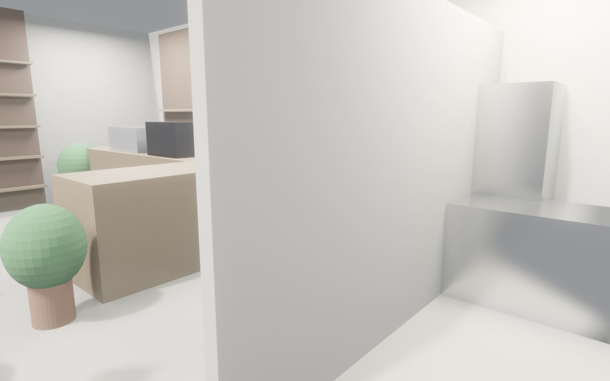
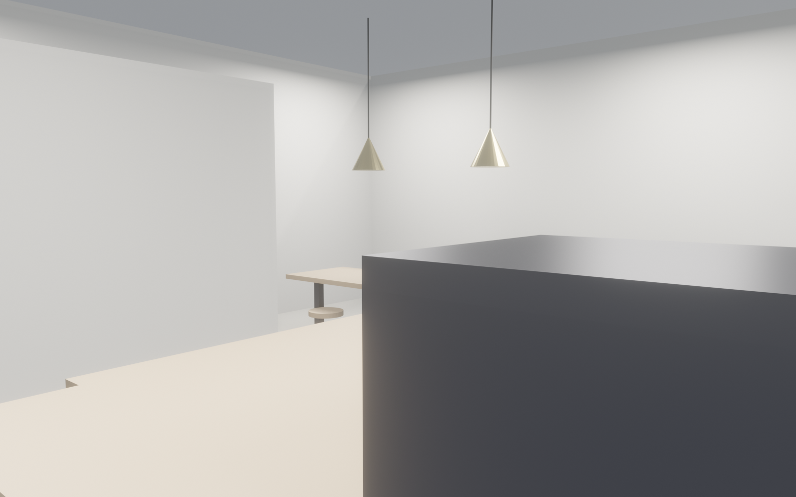
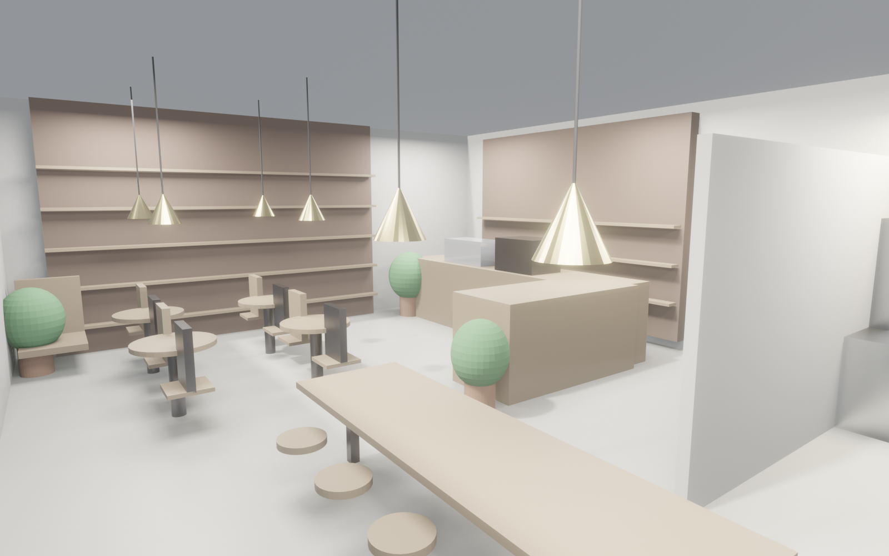

<!-- _class: lead marketing -->

# Coffee Lab
## 你的附近，有棵树，有本书，有杯咖啡
### 品牌 · 开业 · 社媒素材包

---

<!-- _class: split marketing -->

## 目标人群
- **文艺白领** · 25-35 岁 · 小红书/ins 重度
- **自由职业/学生** · 需要一个"不在家 ≠ 办公室"的位置
- **社区熟客** · 5 公里内步行圈 · 早通勤 + 晚社交
- **情侣 / 闺蜜档** · 周末 1-2 小时慢时光

---

<!-- _class: split marketing -->

## 3 大核心卖点
1. **4 米书架墙 · 一面墙就是拍照背景**
2. **30+ 座位 · 来了必有位** (vs 网红店排队)
3. **临街落地窗 · 暖黄吊灯 · 无死角出片**
- 黄铜吊灯 2700 K + 绿植 + 胡桃木 = **ins 直出**

---

<!-- _class: split-2to1 marketing -->

## 氛围感
- 走进门像朋友家客厅，不像商业咖啡店
- 白天落地窗自然光 · 黄昏黄铜吊灯暖光
- 书 + 绿植 + 咖啡香 = 慢下来的理由
- **不是打卡一次，而是想每周来两次**

---

## 关键卖点数字

¥35
均价美式 / 拿铁

30+
稳定座位

4m
书架打卡墙

- 主打咖啡 ¥30-45 · 季节特调 ¥40-55 · 手冲 ¥45-65
- 轻食（三明治/甜点）¥18-38
- 会员月卡「10 杯咖啡 + 第 11 杯免费」

---

<!-- _class: split marketing -->

## 空间故事 · 一天四段
- **早** 8:00 通勤顺路一杯美式 + 油封番茄三明治
- **午** 12:30 午休独坐长桌，书架随便抽一本
- **晚** 17:30 闺蜜聊天 + 一块 Basque · 落日打在书架上
- **夜** 19:00 纸本写信 / 手账时光 / 周末 DJ 派对

---

## 媒体素材包

| 用途 | 文件 | 尺寸 |
|---|---|---|
| 公众号头图 | `renders/01_hero_corner.png` | 1600 × 1000 |
| 小红书九宫格 | `renders/02-06_*.png` | 1600 × 1000 ×5 |
| 平面展示 | `renders/07_top_ortho.png` | 俯视感强 |
| 点评/商户主页 | `renders/08_birds_eye_3d.png` | 鸟瞰大图 |
| Logo/配色板 | `moodboard.png` | 1200 × 600 |

---

## 内容方向（社媒）

1. **店铺 vlog**（小红书 / 抖音）：一天四个时段同机位
2. **咖啡师故事**（视频号）：La Marzocco 调机、手冲特写
3. **书架选书**（小红书图文）：每周推荐 3 本，售卖周边
4. **ASMR**（抖音）：磨豆 + 萃取 + 奶泡声
5. **AI 设计 9 分钟建店**（B 站）：从 brief 到开业幕后
6. **会员故事**（朋友圈）：常客的"我的 Coffee Lab 角落"

---

## 开业营销（W7-W9）

| 阶段 | 内容 |
|---|---|
| T-14 天 | 软开 · KOL 试饮 · 小红书首波种草 |
| T-7 天 | 倒计时物料 · 预售会员卡享 8 折 |
| T-0（开业）| 首日 5 折 · 打卡送周边 · 公众号首推 |
| T+7 | 会员日 · 老带新双人各返 ¥10 |
| T+30 | 月度复盘 · 调菜单 · 第二波 KOC |

---

<!-- _class: lead marketing -->

# 开业首发 · 3 件事

1. **首周体验券**：立减 ¥10 · 限 500 张
2. **会员卡预售**：¥300 储值得 ¥360
3. **打卡返杯**：发朋友圈/小红书 → 免费续杯一次

期待下周一线上线下同步见 ☕
