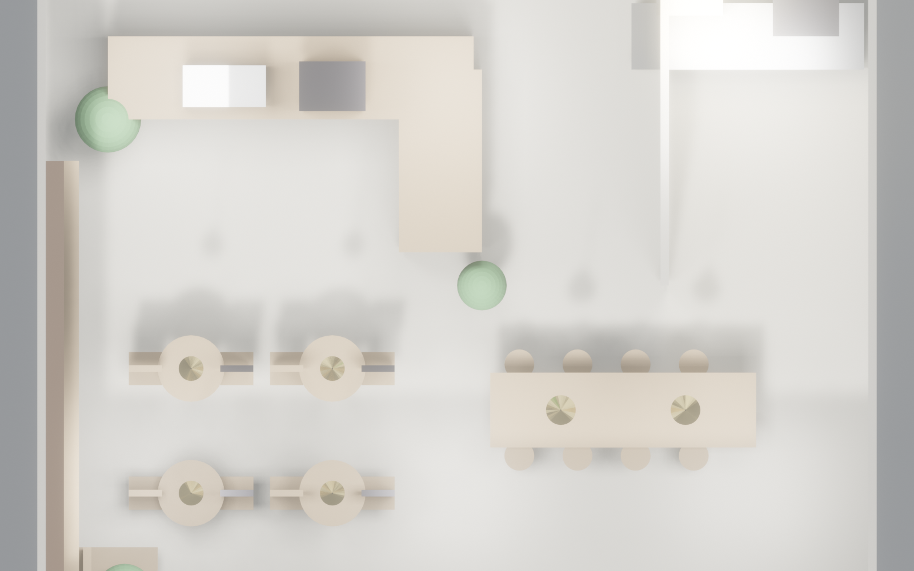
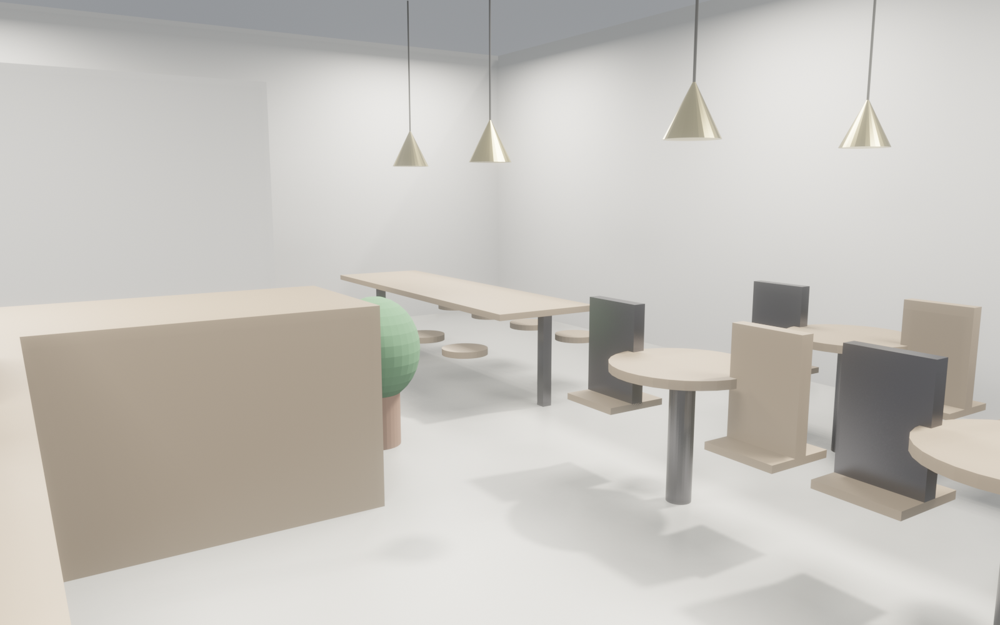

<!-- _class: lead ops -->

# Coffee Lab
## 运营手册概览 · 80 m² 精品咖啡店
### 每日流程 · 食安 · 培训 · 能耗

---

<!-- _class: split-1to2 ops -->

## 空间容量 · 关键数字
- **总座位** 30+（散座 16 + 长桌 8 + 高脚 4 + 沙发 4）
- **峰值接待** 50 pax（含站立/外带）
- **吧台接单能力** ~80 杯/小时（2 咖啡师）
- **日目标** 工作日 100 单 / 周末 160 单
- **翻台率** 目标 4 × / 日

---

<!-- _class: split ops -->

## 客人动线
1. 进门即见 LOGO + 书架墙 → 直觉找到吧台
2. 吧台点单（AI 菜单 + 线下菜单）→ 手机/桌号取餐
3. 散座 / 长桌 / 沙发自由选（非满座不设带位）
4. 离开走相同通道，不穿越后厨
- **动线不交叉** · **客人不触碰后厨**

---

## F&B 单位经济（月度目标）

| 指标 | 值 |
|---|---|
| 日均客流 | 120 单（工作日 100 / 周末 160）|
| 平均客单 | ¥45（咖啡 ¥35 + 加购 ¥10）|
| 月流水 | **¥162,000** |
| 食材成本 | 35%（¥56,700）|
| 人工 | 3 咖啡师 + 2 兼职 = ¥32,000 |
| 房租 | ¥40,000 |
| 水电/耗材/营销 | ¥8,000 |
| **净利** | **~¥25,000 / 月** |

---

## 每日 SOP

| 时段 | 任务 | 负责 |
|---|---|---|
| 07:30 | 开店：磨豆机校准、萃取测试（1 杯弃用）| 主咖啡师 |
| 08:00 | 营业、水吧/展示冷柜补货、扫地拖地 | 全员 |
| 11:30 | 午市峰值准备：奶/豆补齐、洗手 | 全员 |
| 14:00 | 桌面深度清洁、卫生间补给、垃圾换袋 | 兼职 |
| 17:30 | 晚市准备 · 书架整理 · 绿植浇水 | 店长 |
| 21:00 | 打烊：设备冲洗、冷柜库存对账、日结 | 全员 |
| 21:30 | 垃圾分类外倒 · 锁门 · 监控检查 | 店长 |

---

## 食品安全关键点

1. **操作人员**：全员健康证 · 每月指甲检查 · 口罩手套规范
2. **温度管控**：
   - 冷柜 ≤ 4°C · 每日早晚记录
   - 奶类开封标日期 · 3 日内用完
3. **水质**：净水器滤芯 3 月换 · 每周清洗软水树脂
4. **垃圾**：厨余/可回收/有害分三桶 · 每日清运
5. **隔油池**：每 2 周人工清捞 · 月度专业保养
6. **餐具消毒**：高温 100°C × 10 min 或消毒柜

---

## 咖啡师培训（Barista SOP）

| 阶段 | 天数 | 内容 |
|---|---|---|
| W1 | 5 | 咖啡豆知识 · 磨豆机校准 · 意式萃取（18g → 36g / 25-30s）|
| W2 | 5 | 奶泡打发（55-65°C）· 拉花基础 · 手冲 V60 |
| W3 | 5 | SOP 流程 · 收银 + 小程序 · 食安规范 |
| W4 | 5 | 跟岗实训 · 出品考核（盲测 3 款合格）|
| 月度 | — | 新品 + 季度菜单培训 · 交叉学习 |

---

## 能耗预估（月度）

| 项 | 功率/用量 | 月 kWh | ¥ |
|---|---|---|---|
| 照明（2700K 吊灯 + 灯带）| ~200 W × 14h | 84 | 80 |
| 空调（VRV 5 匹）| ~3500 W × 10h | 1050 | 1,000 |
| 咖啡机 La Marzocco | ~3 kW × 14h | 1260 | 1,200 |
| 冷柜 × 2 | ~500 W × 24h | 360 | 340 |
| 后厨设备 + 电热 | ~1 kW × 8h | 240 | 230 |
| 其他（POS/音响/wifi）| 小 | 50 | 50 |
| **合计** | | **~3040 kWh** | **~¥2,900** |

---

## 耗材 + 供应链（月度）

| 类目 | 月用量估 | 供应商 |
|---|---|---|
| 咖啡豆 | 60 kg（120 × 4 × 30/1000）| 主豆 1 + 备豆 1 |
| 奶（鲜奶 + 燕麦奶）| 150 L | 本地日配 |
| 糖浆/糖/配料 | 1 套 | 月补 |
| 纸杯/吸管/餐盒 | 4000 个 | 月补 · 可降解优先 |
| 烘焙/轻食 | 日配 | 本地合作烘焙坊 |
| 清洁剂 / 纸巾 | 1 套 | 月补 |
| 咖啡机耗材（净水/滤芯）| 季度换 | 供应商合约 |

---

## 安全 · 消防 · 保险

| 项 | 要求 |
|---|---|
| 消防通道 | 前门 + 后厨应急门不堵 |
| 灭火器 | ABC 类 × 3 （吧台/后厨/座位区）|
| 应急照明 | 断电自动点亮，每季度测试 |
| 天然气（如用）| 月度检漏 · 探测器联动切断 |
| 食品安全责任险 | ¥100 万保额 · 必买 |
| 公众责任险 | ¥200 万保额 · 必买 |
| 财物险 | 按装修 + 设备投保 |

---

## 维保计划

| 项 | 周期 | 备注 |
|---|---|---|
| 咖啡机深度保养 | 月 | 第三方工程师 |
| 磨豆机刀盘 | 6 月 | 或每 1000 kg 更换 |
| 油烟净化器 | 月 | 清洗 + 年度更换芯 |
| 隔油池 | 2 周 | 人工清捞 + 月度专业 |
| 空调滤网 | 季 | 清洗 |
| 绿植 | 周 | 浇水 + 月度施肥 |
| 灯具 | 年 | 整体检修 |

---

<!-- _class: lead ops -->

# 运营仪表盘建议

- **日报**：客流 · 营业额 · 客单 · 出品差错率
- **周报**：翻台率 · 复购率 · TOP5 产品
- **月报**：毛利 · 净利 · 食材损耗 · 客诉
- **季报**：菜单迭代 · 员工晋升 · 设备检修

小程序接口由 Studio Copilot 开放
