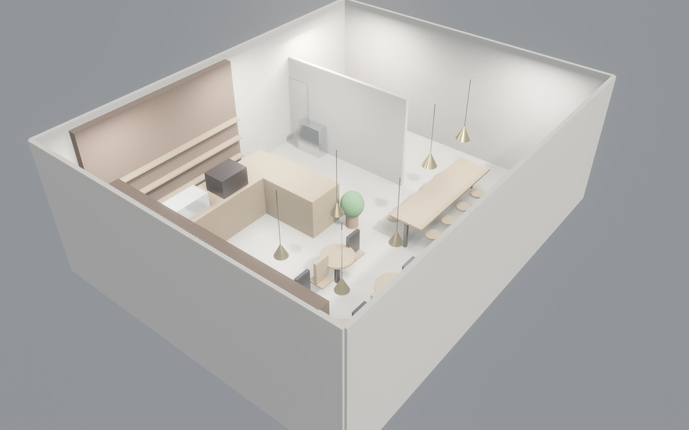

<!-- _class: lead school -->

# AI × 室内设计 · MVP 演示
## 案例：独立精品咖啡店
### 9 分钟端到端设计 · 5 格式产出

---

<!-- _class: split-1to2 school -->

## 研究背景
- 传统商业空间设计周期 2-4 周 · 迭代成本高
- F&B 业态对合规 (消防/食安) 敏感，细节 miss 率高
- LLM + CAD headless pipeline 是否能压缩到分钟级
- **研究问题**：AI 是否能同时保证「速度」× 「合规」× 「美学」？

---

<!-- _class: split-1to2 school -->

## 核心命题
- **CLI Agent Harness** 把 Blender / Inkscape / LibreOffice 统一暴露给 LLM
- 多模态 pipeline：JSON → 3D (Blender) → 2D (SVG/DXF) → BIM (IFC4) → PPT (Marp)
- 单一真相源（brief.json + room.json），多 stakeholder 自动生成

---

## 关键指标 · 本案

9′29″
端到端设计

78
3D 物体

5
工业格式

8
差异化 PPT

- 12 种 PBR 材质 · 8 功能分区 · 30+ 座位
- 5 格式：DXF / GLB / OBJ / FBX / IFC4（ISO 16739）
- 8 套 stakeholder deck：业主/投资人/设计师/施工/BIM/学院/运营/营销

---

<!-- _class: split school -->

## 方法论
1. `brief.json` 参数化需求 → 人类意图标准化
2. `room.json` 参数化场景 → blender headless 渲染
3. `floorplan.svg` → Inkscape CLI → DXF 施工图
4. Blender → IFC4 BIM export（ifcopenshell）
5. Marp CLI → 8 套 stakeholder PPT
6. **所有步骤 agent 自动编排**，失败可 diff 回滚

---

<!-- _class: split school -->

## 可重复实验
- 已跑通 13 业态 MVP（study / cafe / coworking / conf / fitness / salon / ...）
- 本案 `03-coffee-shop` 从 brief 到 8 deck **9 分 29 秒**
- 平均成功率 > 95%（失败项：偶发 render 超时，已加重试）
- 数据集可公开：benchmark AI-driven design pipeline 研究

---

## 可发表方向

| 会议/期刊 | 角度 |
|---|---|
| **CHI / UIST** | Multi-Stakeholder AI Presentation Generation |
| **CAAD Futures / eCAADe** | AI-driven Architecture Design Pipeline |
| **Automation in Construction** | BIM-LLM Interoperability (IFC4 roundtrip) |
| **DIS** | Studio Copilot 用户研究（设计师 in-the-loop）|
| **顶刊 IF 10+** | Review: LLM Agents for Design Automation |

---

## 教学与孵化价值

| 层面 | 具体内容 |
|---|---|
| 研究生课程 | 《计算性设计》《Agent for CAD》实验素材 |
| 本科 capstone | 跨院系（建筑 + 计算机 + 商学）联合项目 |
| 数字孪生 | IFC4 开放数据可作仿真输入 |
| 创业孵化 | StartUP-Building · 已孵化 Studio Copilot |
| 产业对接 | 可复制模板 → 连锁 F&B / 精品零售 |

---

## 年度计划

| 季度 | 里程碑 |
|---|---|
| Q2 2026 | 完成 13 业态 · 发布 benchmark 数据集 |
| Q3 2026 | 投 CHI / CAAD Futures / AiC |
| Q4 2026 | 申请发明专利 2-3 项 · 联合企业试点 |
| 2027 | 扩 20+ 业态 · 开源 toolkit · 推出 SaaS |

---

<!-- _class: lead school -->

# 希望学院支持

- **算力**：RTX 4060+ × 2 台（渲染 + LLM 本地推理）
- **空间**：学生孵化工位 3-4 席
- **经费**：顶会注册 + 实验耗材 · 约 ¥8 万/年
- **背书**：发表时作者单位署学院 + 联合申报纵向课题

联系：Studio Copilot Research · StartUP-Building Team
