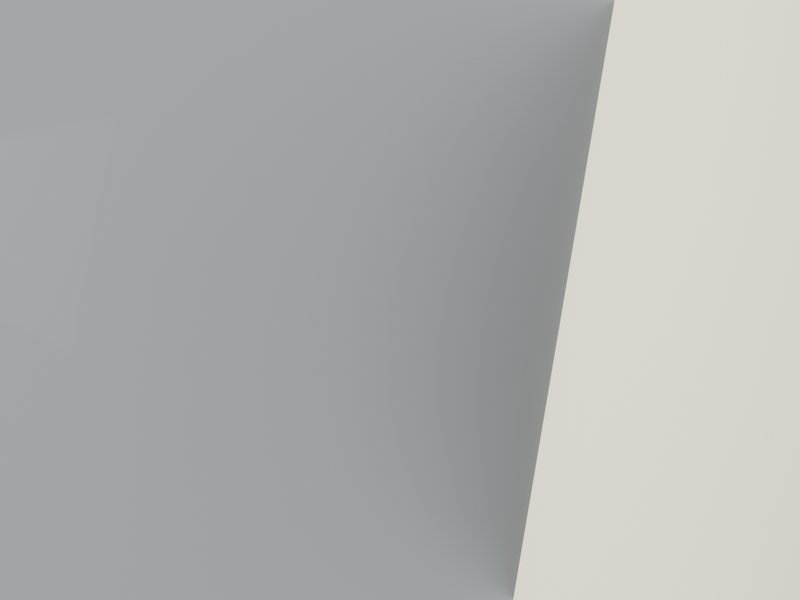

# 精品健身工作室 Lift Studio · v1

## 核心指标

| 面积 | 造价 | EUI | 合规 |
|:-:|:-:|:-:|:-:|
| 100 m² | HK$ 1,029,016 | 119.6 kWh/m²·yr | 7/8 (HK) |

## 方案亮点

100 m² 精品健身工作室沿 industrial 与 matte-black 语言定调。全反射 mirror-heavy 墙面占据主自由力量区一侧，瑜伽/普拉提区以声学隔断分开，噪声相互不干扰。strong-clean 的器械区旁是 10 只独立储物柜与前台。晨间训练结束后，自然光从高窗斜入地垫，镜墙映出的不止动作，还有光线从黑到亮的渐变。

## 作品展示

**1.** 

**2.** 

**3.** 

**4.** 

## 交付清单

- 3D 模型 · 5 件套（DXF / FBX / GLB / IFC / OBJ）
- 图纸 · 1 张平面 · 0 立面 · 0 剖面
- 8 份角色定制方案书
- Blender scene: 90 objects · IFC4 products: 94

[联系我们 · 要类似方案 →](mailto:studio@example.com?subject=05-fitness-studio)
