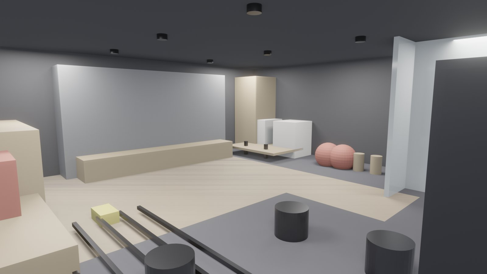
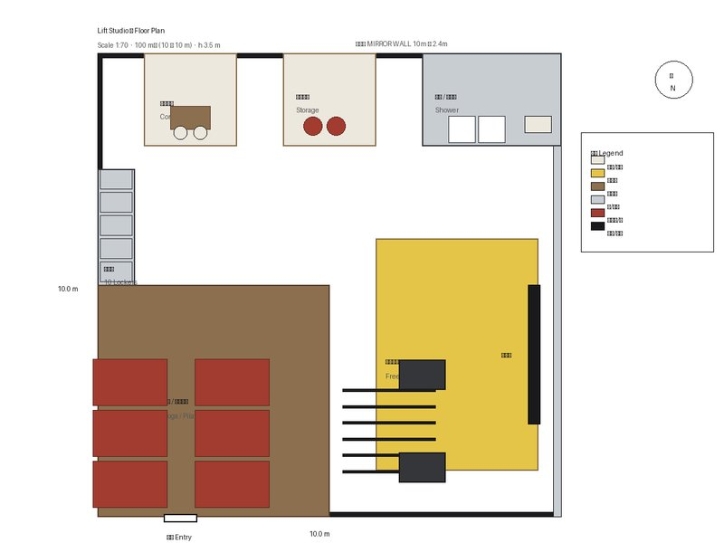
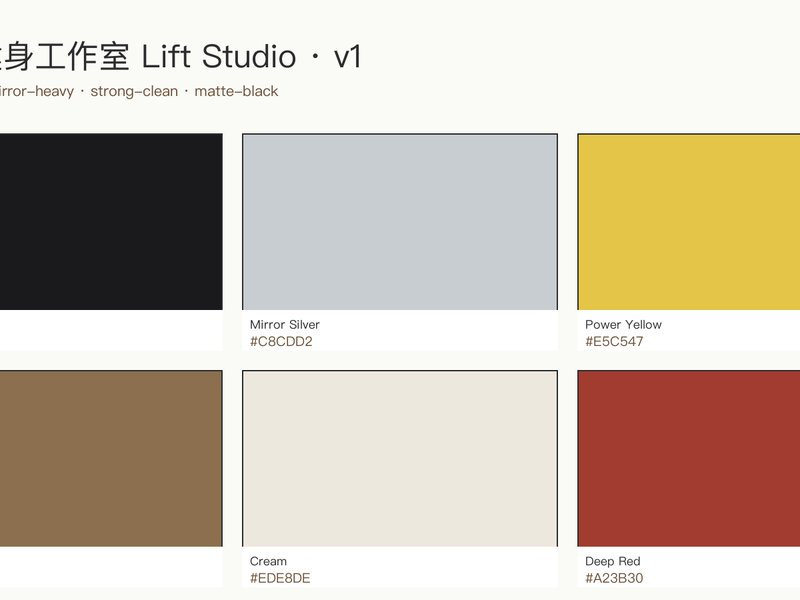

# 小型精品健身品牌主理人 · 从"需求 → 可施工方案" 10 分钟内

你要做一家 100 m² 精品健身，镜面墙、力量区、瑜伽区都想独立；找设计公司从 HK$ 40k 起，周期两到四周；等到开业前测声学才发现瑜伽区吵得没法练。

现在一次给齐：industrial 风格的 3D 效果图、镜墙 + 力量区 + 瑜伽区的声学分区平面、10 个储物柜位置、8 份给馆主 / 教练 / 施工 / 声学顾问 / 物业的方案书、港币报价。

结果：90 件模型构件 · 合规 7/9 · EUI 119.6 · HK$ 1.03M 报价 · 15 分钟完整交付。

## 实测结果（本案例）

| 设计耗时 | 交付文件 | 合规通过 |
|:-:|:-:|:-:|
| 15 分钟 | 14 份 | 7/8 (HK) |

## 类似方案

  

**→ 回复本邮件或扫码 contact us · 48 小时内给你的 小型精品健身品牌主理人 出第一版。**
