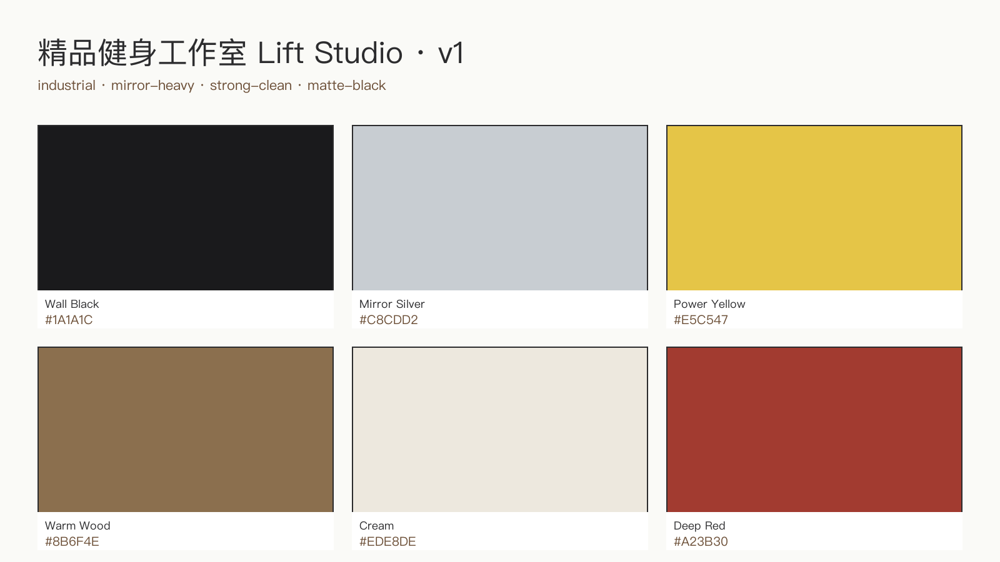
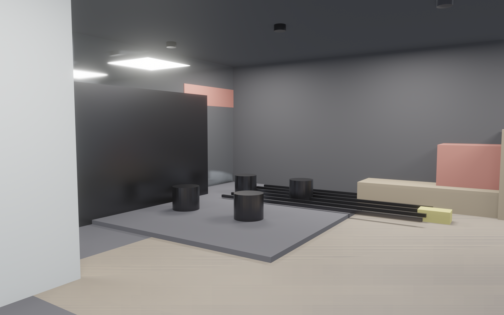

<!-- _class: lead client -->

# Lift Studio
## 精品健身工作室 100 m² · v1
### 给 业主 的方案介绍

 

| 设计周期 | 方案版本 | 决策点 |
|---|---|---|
| 9 分 29 秒 | v1 | 4 个 |

---

<!-- _class: split client -->

## 风格定调
- **关键词**：industrial · mirror-heavy · strong-clean
- **主色**：哑黑墙 · 镜面银 · 电光黄点缀
- **感觉**：专业、高能量、社媒出片率高
- **对标**：Barry's · Equinox · SPEEDFIT

---

<!-- _class: split client -->

## 第一眼印象
- 进门即看到 LOGO 墙 + 接待台
- 展示墙挂蛋白粉 / 护具 / 品牌周边
- 接待椅 2 张，新客入会洽谈
- 灯光：聚光打 LOGO，强品牌感

---

<!-- _class: split client -->

## 核心：自由力量区
- 3 层哑铃架 · 6 支杠铃 · 1 举重平台
- 地面：20 mm 橡胶地垫 + 下衬加固
- 层高 3.5 m 满足深蹲/硬拉甩放
- 电光黄标线划分安全区

---

<!-- _class: split client -->

## 瑜伽 / 普拉提区
- 木地板铺装 · 6 垫位 2×3 格
- 与力量区声学分隔（哑黑吸音板）
- 镜面墙全反射 10 m × 2.4 m
- 顶部线性灯带突出动作线条

---

<!-- _class: split client -->

## 私教咨询角 + 储物柜
- 咨询角视觉独立：木质隔屏 + 暖光
- 10 个独立储物柜，带密码锁
- 长凳方便换鞋
- 淋浴干湿分离，2 间独立隔间

---

<!-- _class: split client -->

## 平面图（俯视）
- 10 × 10 m 整层 · 8 个功能分区
- 动线：入口 → 储物柜 → 训练区 → 淋浴
- 力量 24 m² · 瑜伽 30 m² · 镜面墙满墙

---

## 4 个决策点

| # | 决策点 | 选项 |
|---|---|---|
| 1 | 主色走向 | 纯工业黑 / 黑+暖木 / 黑+深红 |
| 2 | 镜面墙范围 | 单面 10 m / 双面 L 型（贵 ¥3 万） |
| 3 | 瑜伽区地板 | 实木 / 橡木复合 / 竹地板（成本递增） |
| 4 | 声学分隔形式 | 软隔断帘 / 半高吸音墙 / 全高隔墙 |

---

## 预算 + 工期

| 项目 | 金额 |
|---|---|
| 拆改 + 地面加固（力量区） | ¥70,000 |
| 镜面墙 + 木地板 + 软装 | ¥110,000 |
| 器械（哑铃/杠铃/普拉提） | ¥100,000 |
| 灯光 + 电路 + 通风 | ¥40,000 |
| 软装 + 品牌视觉 | ¥30,000 |
| **合计** | **¥350,000** |

工期 **6 周**：拆改 1 / 地面 1 / 隔断电路 1 / 镜面木地板 1 / 器械进场 1 / 验收 1

---

<!-- _class: lead client -->

# 下一步

> 方案已就绪 · 等你反馈

- **微调**（颜色/数字）→ 5 分钟出新版本
- **重排**（器械/分区）→ 10 分钟
- **换风格**（整套配色）→ 20 分钟

联系：Studio Copilot Team
