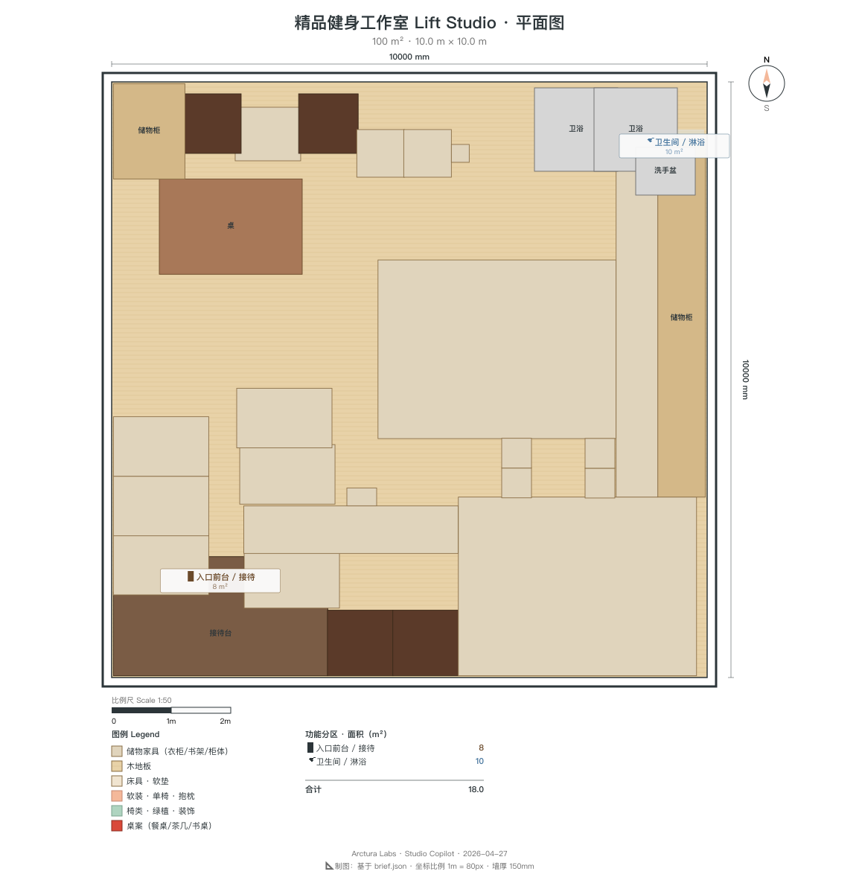

<!-- _class: lead designer -->

# Lift Studio · 深化设计交付包
## v1 源文件清单 + 材质/尺寸/工具链
### 给 接手深化的 室内设计师

---

## 源文件清单

| 文件 | 用途 | 工具 |
|---|---|---|
| `brief.json` | 需求锚点 | 任意文本编辑器 |
| `room.json` | 3D 场景参数 | Blender CLI |
| `floorplan.svg` | 2D 可编辑平面 | Inkscape |
| `floorplan.dxf` | AutoCAD/Rhino/QCAD | 施工深化 |
| `exports/*.glb/obj/fbx/ifc` | 多格式 3D | Three.js / Maya / Revit |
| `decks/deck-*.md` | Marp PPT 源文件 | marp-cli |
| `renders/*.png` | 8 角度渲染图 | 已生成 |

---

<!-- _class: split designer -->


## 风格关键词 + 配色码
- **industrial · mirror-heavy · strong-clean · matte-black**
- `wall_black` **#1A1A1C** 哑黑墙
- `mirror_silver` **#C8CDD2** 镜面银
- `power_yellow` **#E5C547** 电光黄点缀
- `warm_wood` **#8B6F4E** 暖木（瑜伽区）
- `cream` **#EDE8DE** 奶油（休息区）
- `deep_red` **#A23B30** 深红（品牌）

---

<!-- _class: split designer -->


## 平面图（俯视渲染）
- 10 × 10 × 3.5 m · 100 m²
- 8 功能分区：前台/储物柜/力量/瑜伽/镜面/淋浴/咨询/储藏
- 总 3D 物体：~95 件
- 材质索引：9 种 PBR

---

<!-- _class: split designer -->



## 平面图（SVG 可编辑）
- 标注尺寸 · 分区色块 · 器械位
- 可在 Inkscape 调整器械位置
- 改后 `rsvg-convert -d 150 floorplan.svg -o floorplan.png`

---

## Material PBR 参数

```
MatteBlackWall : base #1A1A1C, roughness 0.85, metallic 0.0
RubberFloor    : base #2A2A2C, roughness 0.90, metallic 0.0
MirrorSilver   : base #C8CDD2, roughness 0.02, metallic 0.95
WarmWoodFloor  : base #8B6F4E, roughness 0.55, metallic 0.02
PowerYellow    : base #E5C547, roughness 0.55, metallic 0.0
DeepRed        : base #A23B30, roughness 0.60, metallic 0.0
Cream          : base #EDE8DE, roughness 0.80, metallic 0.0
DarkMetal      : base #2C2C2E, roughness 0.35, metallic 0.85
Glass          : base #DCE3DA, roughness 0.05, transmission 0.9
```

---

## 关键尺寸

| 区 | 尺寸 | 备注 |
|---|---|---|
| 自由力量区 | 6 × 4 m (24 m²) | 层高净 3.4 m，容杠铃甩放 |
| 瑜伽区 | 6 × 5 m (30 m²) | 6 垫位 2×3 格，垫 1.8×0.6 m |
| 镜面墙 | 10 × 2.4 m | 全反射，地面起 200 mm |
| 储物柜 | 3 × 2 m (6 m²) | 10 柜 2×5 阵列 |
| 淋浴 | 10 m² | 2 隔间 + 洗手台 + 干湿分离 |
| 私教咨询 | 8 m² | 桌 1.2×0.7 + 2 椅 |

---

## 照明规划

| 区 | 灯具 | 色温 | 数量 |
|---|---|---|---|
| 力量区 | 黑色轨道射灯 | 4000K | 4 |
| 瑜伽区 | 线性灯带（顶） | 4000K | 2 条 10 m |
| 镜面墙顶 | 线性灯带 | 4000K | 1 条 10 m |
| 前台 | 黄铜吊灯 | 2700K | 1 |
| 私教角 | 暖光射灯 | 2700K | 2 |
| 淋浴 | 防潮面板 | 4000K | 2 |

---

## 文件编辑映射

- **改 3D 物体** → `room.json` → Blender CLI 重出 → `_render_multi.py`
- **改平面** → `floorplan.svg` (Inkscape) → 重导 PNG/DXF
- **改材质** → 编辑 Blender 材质 → 重渲染
- **改 PPT** → `decks/deck-*.md` (Marp) → `build_pptx.sh .`
- **改 BIM** → `exports/*.ifc` (BlenderBIM 编辑)

---

<!-- _class: split designer -->


## 力量区深化要点
- **地面承重**：原楼板 + 20 mm 胶合板 + 20 mm 橡胶
- 局部加固至 800 kg/m²（深蹲架/硬拉平台位）
- 墙面：哑黑吸音板 50 mm，吸收甩铁噪音
- 预留 3 个 220V 插座给拉伸枪/音响

---

<!-- _class: split designer -->


## 瑜伽区深化要点
- **地板**：15 mm 实木复合，弹性底层（运动缓冲）
- 声学：与力量区之间软隔断（移动帘 + 吸音软包）
- 空调：单独支路，温度独立控制（瑜伽偏暖 24°C）
- 蓝牙音箱嵌入天花 × 2

---

## CLI 工具链

- `blender-cli` — room.json → GLB/OBJ/FBX/IFC4 导出
- `inkscape-cli` — floorplan.svg → PNG/DXF 导出
- `marp-cli` — deck-*.md → PPTX/PDF
- `libreoffice-cli` — 备用 ODP 导出

详见 `CLI-Anything/.claude/skills/*/SKILL.md`

---

<!-- _class: lead designer -->

# 下一步

你来深化哪个区？告诉我，源文件即刻给到：
- 力量区承重节点 → DXF 分层图
- 瑜伽区声学 → STC 模拟报告
- 镜面墙挂装 → 节点大样
- 品牌 VI 延展 → AI 色 + VI 模板
