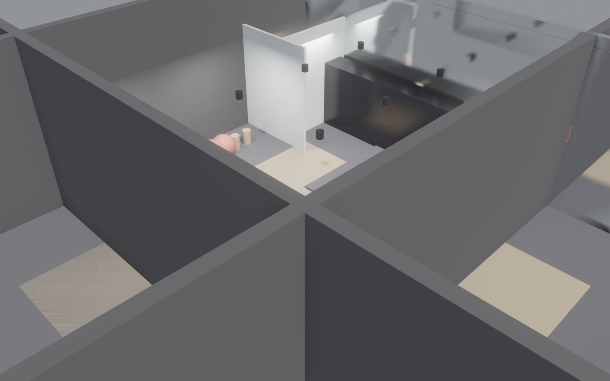

<!-- _class: lead investor -->

# Lift Studio
## AI 驱动的精品健身连锁 · 9 分钟出方案
### 给 投资人 / 合伙人

---

<!-- _class: split investor -->


## 市场机会
- 中国健身会员渗透率 **1.0%**（vs 美国 ~20%）
- 精品小工作室（Boutique）年增 15-20%
- 传统大店空置率 30%+，小店坪效高 3x
- 100 m² 单店 CAPEX 35-50 万，回本 < 20 个月

---

<!-- _class: split investor -->



## 产品：100 m² 标准精品店
- 自由力量 24 m² + 瑜伽/普拉提 30 m²
- 10 储物柜 + 2 淋浴 + 私教咨询角
- 全反射镜面墙（打卡点）
- 工业风 · 可复制视觉 IP

---

<!-- _class: split investor -->


## 核心差异化
- **AI 9 分钟出完整方案**（vs 行业 2-4 周）
- 选址 → 平面 → 渲染 → BIM → 施工包一键生成
- 5 种工业格式交付（DXF/GLB/OBJ/FBX/IFC4）
- 设计费从 ¥30K 降至近 0，利好快速铺店

---

## 单位经济模型

<div class="kpi-grid">
<div><div class="big-number">¥350K</div>单店 CAPEX</div>
<div><div class="big-number">¥58K</div>月满租收入*</div>
<div><div class="big-number">18-22</div>回收月数*</div>
</div>

```
月收入  = 月卡 80 × ¥599 + 团课包 40 × ¥299 + 私教 30h × ¥300
        = ¥47,920 + ¥11,960 + ¥9,000  ≈ ¥69,000 (满员)
保守 70% 利用率：  ≈ ¥48,000 / 月
CAPEX   = ¥350,000 (装修+器械含)
回收期  ≈ 18-22 个月
```

---

## vs 行业对标

| 维度 | Lift Studio | 超级猩猩 | 乐刻 |
|---|---|---|---|
| 单店面积 | 100 m² | 200 m² | 300 m² |
| 单店 CAPEX | 35 万 | 80 万 | 150 万 |
| 月费 | ¥599 | 按次 ¥79 | ¥299 |
| 品类 | 力量+瑜伽 | 团课 | 综合 |
| 设计周期 | 9 分钟 | 2-4 周 | 2-4 周 |

---

<!-- _class: split investor -->


## 样板已成型
- 5 种格式交付：DXF (施工) / GLB (预览) / IFC4 (BIM) / OBJ (渲染) / FBX (动画)
- 13 个业态 MVP 模板池（健身 / 咖啡 / 书店 / 美发 / 牙科 ...）
- 设计 + 品牌 VI + 营销素材一套生成

---

## 6 周从 0 到开业

| 周 | 里程碑 |
|---|---|
| W1 | 拆改 + 地面加固（力量区承重） |
| W2 | 水电改造 + 墙体隔断 |
| W3 | 镜面墙 + 木地板铺装 |
| W4 | 灯具 + 通风 + 软装 |
| W5 | 器械进场 + 调试 |
| W6 | 试运营 + 开业 |

---

## 单店 CAPEX 明细

| 项目 | 金额 | 占比 |
|---|---|---|
| 装修（硬装） | ¥140,000 | 40% |
| 器械（力量+瑜伽） | ¥100,000 | 29% |
| 灯光/通风/电路 | ¥40,000 | 11% |
| 软装+VI+品牌 | ¥30,000 | 9% |
| 加固+拆改 | ¥40,000 | 11% |
| **合计** | **¥350,000** | **100%** |

---

## 风险 + 缓解

| 风险 | 缓解措施 |
|---|---|
| 选址客流不及预期 | AI 多选址模拟，开业前 30 天推广 |
| 器械折旧快（3-5 年） | 与渠道签保值置换合同 |
| 教练招募难 | 与健身学院合作 + 分润模式 |
| 会员续费率下滑 | 团课包 + 私教捆绑提升粘性 |
| 竞品降价 | 精品 IP + 社群绑定 |

---

<!-- _class: lead investor -->

# 本轮募资

## ¥500 万 · 落地 10 家 · 验证可复制性

- 单店 CAPEX ¥35 万 × 10 = ¥350 万
- 团队 + 营销 = ¥100 万
- 储备金 = ¥50 万

📈 18 个月验证单店模型 · 24 个月开放加盟
