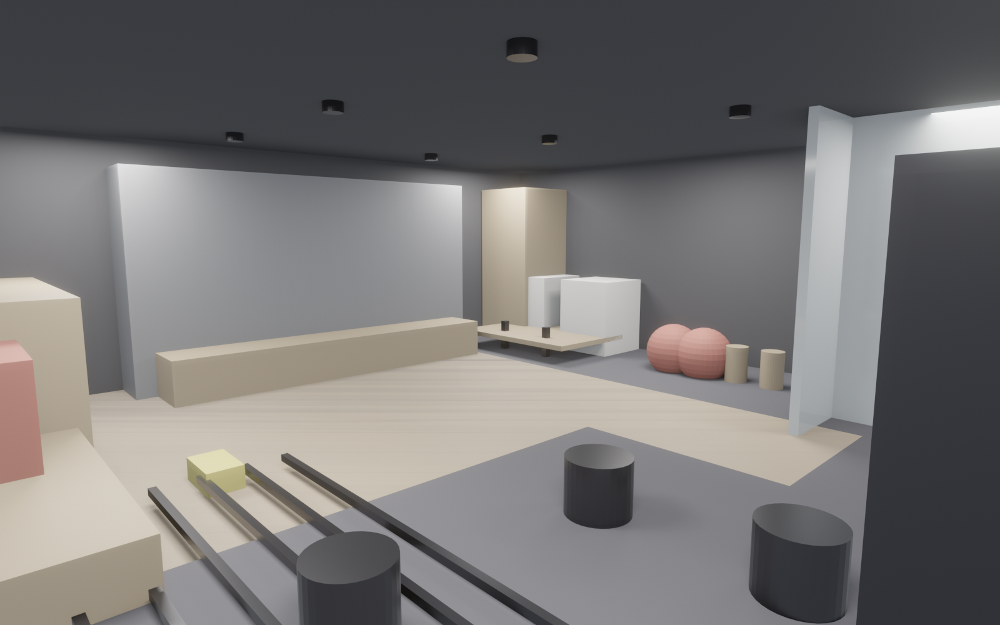

<!-- _class: lead marketing -->

# Lift Studio
## 你身边的精品力量工作室
### 给 品牌经理 / 社媒运营

---

<!-- _class: split marketing -->

## 目标人群
- **25-35 都市白领**：追求体态 + 打卡
- **健身老手**：不满大店拥挤、要自由力量
- **瑜伽 / 普拉提爱好者**：需要安静 + 木地板
- **小团体私教**：1 对 1 或 1 对 2 场景

---

<!-- _class: split marketing -->

## 3 个核心卖点
- ① **全反射镜面墙** 10 m × 2.4 m — 社媒出片神器
- ② **力量 × 瑜伽声学分隔** — 互不打扰，各练各的
- ③ **精品小班** — 不像大店等器械，90% 并发不排队

---

<!-- _class: split marketing -->

## 转型照片系列（Before/After）
- 月卡会员 **入会 / 3 个月 / 6 个月** 三张图打包
- 统一拍摄位：镜面墙前
- 统一灯光：顶部线灯
- 会员授权后 → 小红书 / 抖音投放素材

---

## 关键数字

¥599
月卡起

10
镜面 m 长

80
会员上限

6 週
开业倒计时

---

<!-- _class: split marketing -->

## 一天的 Lift Studio
- **7:00** 晨瑜伽（舒缓唤醒）
- **12:00** 午间 HIIT（30 min 速战）
- **19:00** 力量课 / 私教黄金档
- **20:00** 普拉提 / 瑜伽（放松收官）
- **全天** 月卡自由训练

---

## 社媒内容矩阵

| 平台 | 方向 | 频率 |
|---|---|---|
| **小红书** | 转型日记 · 镜面墙打卡 · 穿搭 | 每周 3 |
| **抖音** | 课程片段 · 教练讲解 · 会员挑战 | 每周 5 |
| **视频号** | 会员故事 vlog · 品牌日常 | 每周 2 |
| **B 站** | 训练科普 · AI 9 分钟设计幕后 | 每月 2 |
| **公众号** | 课表 · 会员故事 · 运营通知 | 每周 1 |

---

## 开业营销节奏（6 周）

| 周 | 活动 |
|---|---|
| W-4 | 官宣海报 + 小红书悬念贴（"家附近有件大事"） |
| W-3 | 会员早鸟 399 元/月体验卡（限 50 名） |
| W-2 | 教练阵容发布 + 免费体验报名 |
| W-1 | 试营业 / 种子会员体验 / KOC 探店 |
| W0 | 开业日活动（签到领券 + 会员打卡挑战） |
| W+2 | 30 天转型挑战（镜面墙 Before/After） |

---

## 必备素材清单

| 用途 | 文件 | 尺寸 |
|---|---|---|
| 公众号头图 | `renders/01_hero_corner.png` | 1600×1000 |
| 小红书九宫格 | `renders/02-06_*.png` | 1600×1000 |
| 大众点评封面 | `renders/04_feature_zone.png` | 1200×800 |
| 楼层鸟瞰 | `renders/08_birds_eye_3d.png` | 1600×1000 |
| 平面图（带分区） | `renders/07_top_ortho.png` | 展示空间感 |
| 品牌 VI 色 | `moodboard.png` | 1200×600 |

---

<!-- _class: lead marketing -->

# 首发优惠

- **早鸟季卡 ¥1,299**（原 ¥1,599）
- **组队 8 折** 3 人同报
- **试训免费** 一次 45 min + 体测
- **KOC 探店**：发小红书笔记返月卡

联系：Lift Studio 品牌营销组
