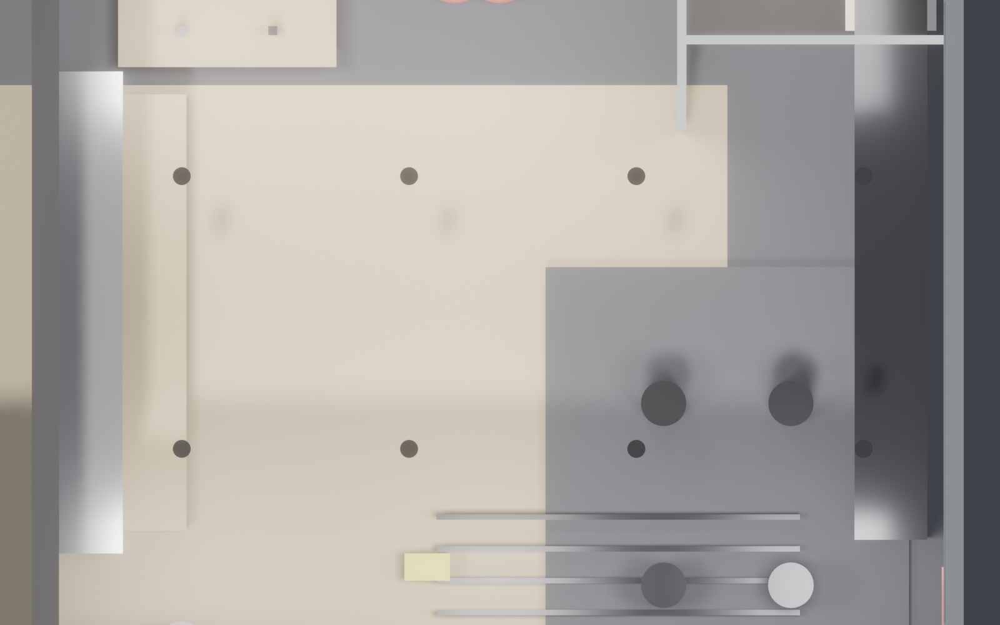

<!-- _class: lead ops -->

# Lift Studio · 运营手册概览
## 100 m² 精品健身工作室
### 给 运营经理 / 店长

---

<!-- _class: split ops -->

## 空间容量
- **月卡会员**：80 人上限（峰值并发 15）
- **团课**：单场 8 人（瑜伽 / 普拉提 / HIIT）
- **私教**：3 教练 × 6 时段 / 天
- **储物柜**：10 个（含临时会员轮用）
- **淋浴**：2 隔间（高峰排队 ≤ 5 min）

---

<!-- _class: split ops -->

## 会员动线
1. 前台刷卡 / 扫码签到
2. 领储物柜钥匙 → 更衣
3. 训练区（力量 / 瑜伽 / 私教咨询）
4. 淋浴 → 归还钥匙 → 离场
5. 私教/团课：小程序预约 → 自动扣费

---

## 会员体系

| 类型 | 价格 | 权益 |
|---|---|---|
| 月卡（自由训练） | ¥599 | 力量 + 瑜伽无限次 |
| 季卡 | ¥1,599 | 同上 + 1 次私教体验 |
| 年卡 | ¥4,999 | 同上 + 4 次私教 + 徽章 |
| 团课 10 次包 | ¥299 | 瑜伽/普拉提/HIIT |
| 私教单节 | ¥300 | 60 min |
| 日卡 | ¥98 | 全设施 1 日 |

---

## 课表安排（周）

| 时段 | 周一 | 周三 | 周五 | 周六 |
|---|---|---|---|---|
| 7:00 | 晨瑜伽 | — | 晨瑜伽 | — |
| 12:00 | HIIT | 普拉提 | HIIT | 普拉提 |
| 19:00 | 力量课 | 瑜伽 | 私教档 | 开放训练 |
| 20:00 | 普拉提 | HIIT | 瑜伽 | — |

教练排班：每周一提交 → 小程序同步

---

## 每日清洁 SOP

| 时段 | 区域 | 任务 |
|---|---|---|
| 6:50 开门前 | 全店 | 通风 + 镜面擦拭 + 地面拖 |
| 12:00 | 淋浴 | 补纸巾/沐浴露 + 地漏清洁 |
| 14:00 | 瑜伽区 | 垫面消毒 + 木地板湿拖 |
| 19:00 | 力量区 | 器械酒精擦拭 + 哑铃归位 |
| 22:00 打烊 | 全店 | 深度清洁 + 储物柜开放 |

消毒耗材：医用酒精 / 季铵盐 / 次氯酸

---

## 能耗 / 耗材预估

| 项 | 月用量 | 月费用 ¥ |
|---|---|---|
| 电（照明+空调+设备） | ~1800 kWh | 1,200 |
| 水（淋浴为主） | ~45 t | 360 |
| 清洁耗材 | — | 600 |
| 洗手液/纸巾 | — | 400 |
| 卫生用品 | — | 300 |
| 器械易耗（杠铃片/瑜伽垫） | — | 500 |
| **月总开支** | | **~¥3,360** |

---

## 关键风险点

| 风险 | 预警 | 应对 |
|---|---|---|
| 力量区楼板挠度 | 半年专业检测 | 加固 / 限载 |
| 镜面墙松动 | 每月目检 | 结构胶重做 |
| 声学衰减下降 | 季度 dB 实测 | 更换吸音板 |
| 淋浴地漏堵塞 | 每周检查 | 外包疏通 |
| 异味（汗+鞋） | 每日 2 次通风 | 强排风 + 除味剂 |
| 会员受伤 | — | 公众责任险 + 免责协议 |

---

## 保险 + 免责

### 必备险种
- **公众责任险**：保额 ≥ ¥100 万（会员意外）
- **财物险**：器械 + 装修（保额 ≥ ¥50 万）
- **雇主责任险**：教练 / 前台
- **团体意外险**：可选择给会员团购

### 免责协议（入会必签）
- 自身健康状况告知义务
- 器械使用按教练指导
- 贵重物品自行保管
- 私教与工作室分责条款

---

## 维保计划

| 项 | 周期 | 供应商 |
|---|---|---|
| 镜面墙检查 | 月 | 自查 |
| 镜面结构胶 | 2 年 | 外包 |
| 空调滤网 | 季度 | ______ |
| 新风滤芯 | 半年 | ______ |
| 器械紧固件 | 月 | 器械商 |
| 瑜伽垫更换 | 半年 | ______ |
| 木地板打蜡 | 年 | ______ |
| 消防器材检测 | 年 | 消防公司 |

---

<!-- _class: lead ops -->

# 运营仪表盘建议

- 日签到数 / 日新增会员 / 课程出席率
- 私教课时占比 / 团课满员率
- 会员续费率（月环比）
- 投诉响应时长（目标 < 2 h）
- 器械使用频次 Top 5 / Bottom 5
