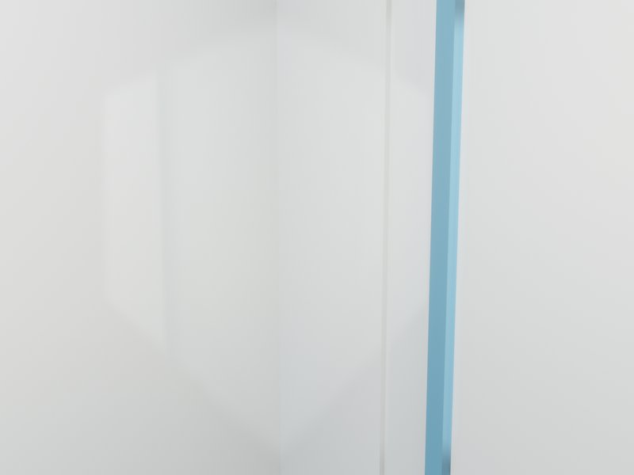

# Stack Lab · AI Startup 办公室 · v1

## 核心指标

| 面积 | 造价 | EUI | 合规 |
|:-:|:-:|:-:|:-:|
| 130 m² | HK$ 1,140,220 | 88.1 kWh/m²·yr | 7/8 (HK) |

## 方案亮点

130 m² AI 创业办公室以 tech-loft 与 plant-rich 为主线。10 工位沿侧墙布置，每位配双屏，GPU 机柜服务器室独立制冷 + 5kW 专电并配玻璃观察门，玻璃会议室四面通透 + 4m 白板墙。code-cave-lite 的 2 只电话亭贴入口，exposed-pipe 的天花保留原始金属质感。深夜服务器风扇声与键盘声混在一起，工位绿植在冷白光下同样生长。

## 作品展示

**1.** 

**2.** 

**3.** 

**4.** 

## 交付清单

- 3D 模型 · 5 件套（DXF / FBX / GLB / IFC / OBJ）
- 图纸 · 1 张平面 · 0 立面 · 0 剖面
- 8 份角色定制方案书
- Blender scene: 118 objects · IFC4 products: 122

[联系我们 · 要类似方案 →](mailto:studio@example.com?subject=13-ai-startup-office)
