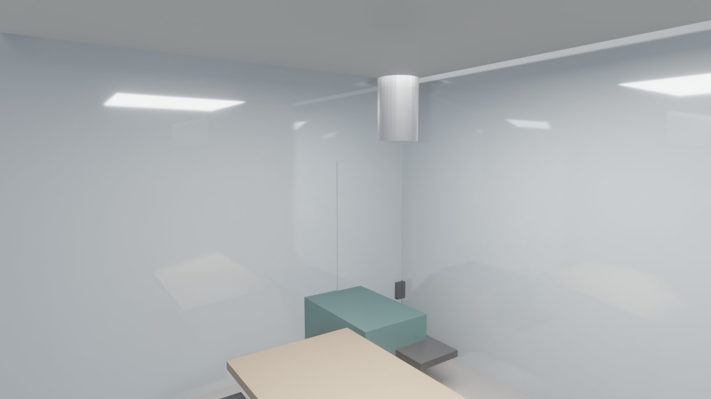
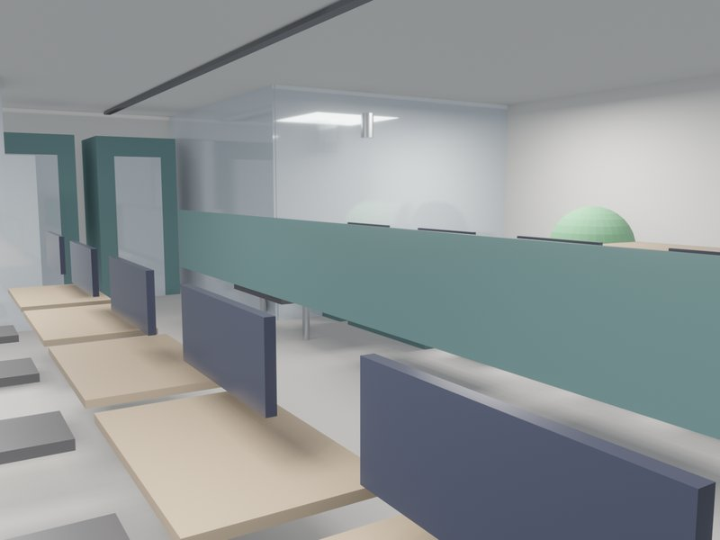
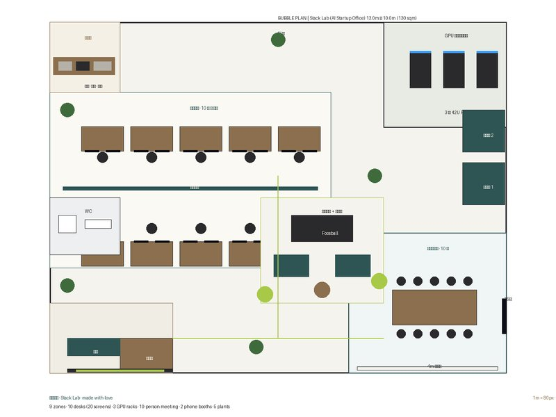
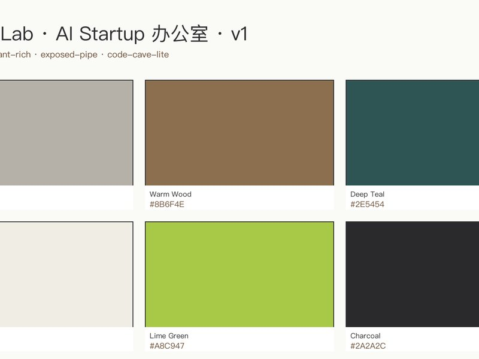

# AI 创业团队 (致敬业主) · 从"需求 → 可施工方案" 10 分钟内

你要给 AI 团队做 130 m² 办公，10 工位 + 双屏 + GPU 机柜 + 玻璃会议室 + 电话亭都要到位；设计 HK$ 40k+ 起，GPU 机柜的电力和散热还得单独找人；方案后期才发现散热不足、机柜位不合规。

一次给齐：tech-loft 风格效果图、10 工位 + GPU 室 + 会议室 + 电话亭的完整布置、5kW 专电 + 独立制冷位图、8 份给创始人 / IT / 施工 / 电力 / 物业的方案书、港币报价。

结果：118 件模型构件 · 122 件 IFC · 合规 7/9 · HK$ 1.14M · 23 分钟交付。

## 实测结果（本案例）

| 设计耗时 | 交付文件 | 合规通过 |
|:-:|:-:|:-:|
| 23 分钟 | 14 份 | 7/8 (HK) |

## 类似方案

  

**→ 回复本邮件或扫码 contact us · 48 小时内给你的 AI 创业团队 (致敬业主) 出第一版。**
