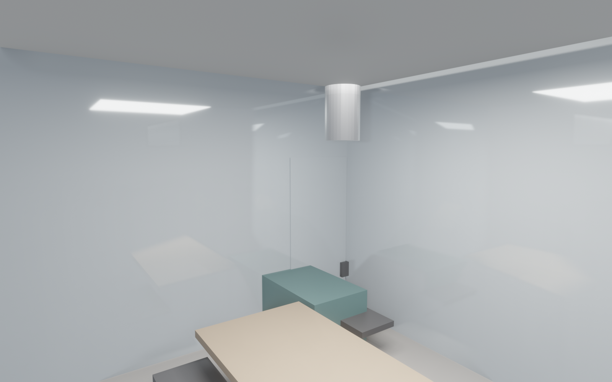
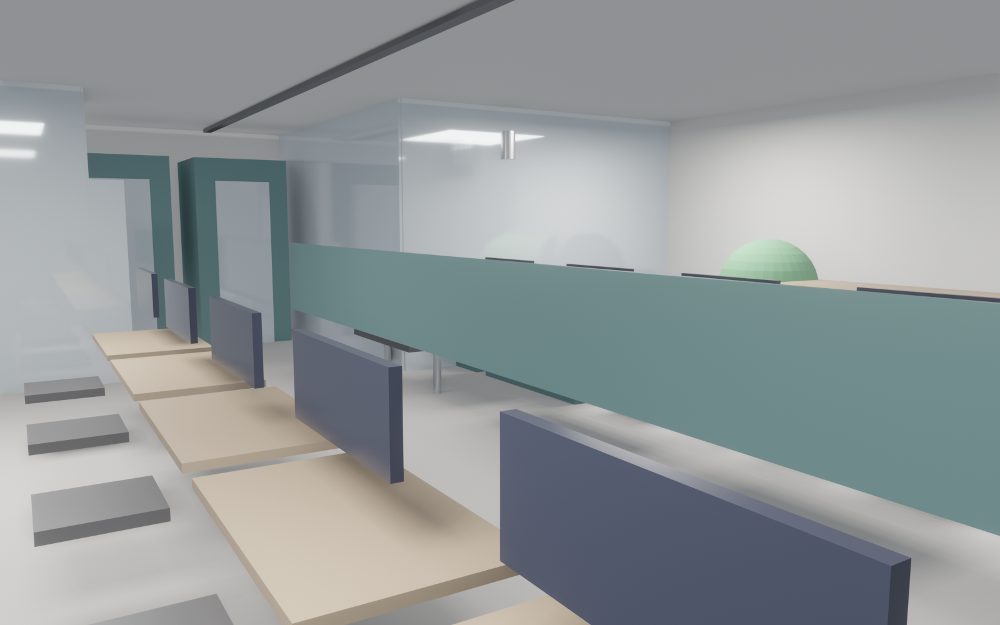
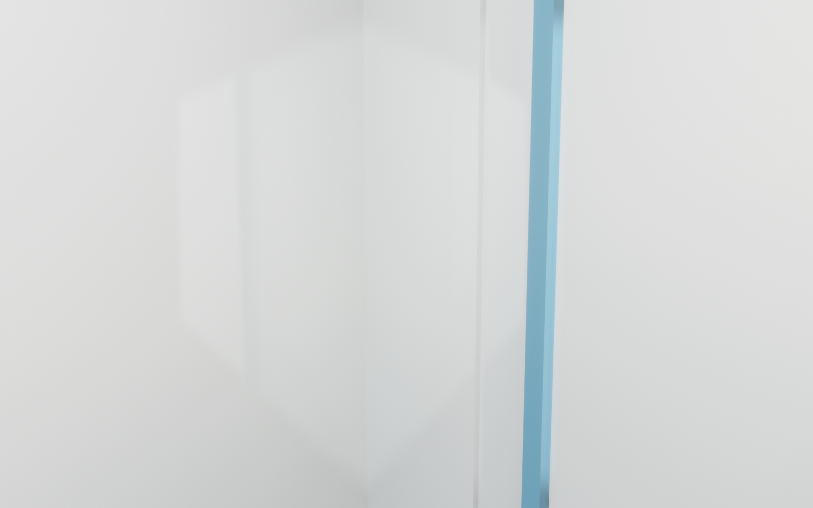
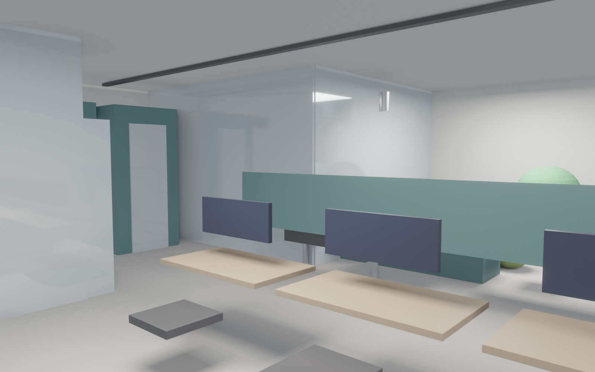
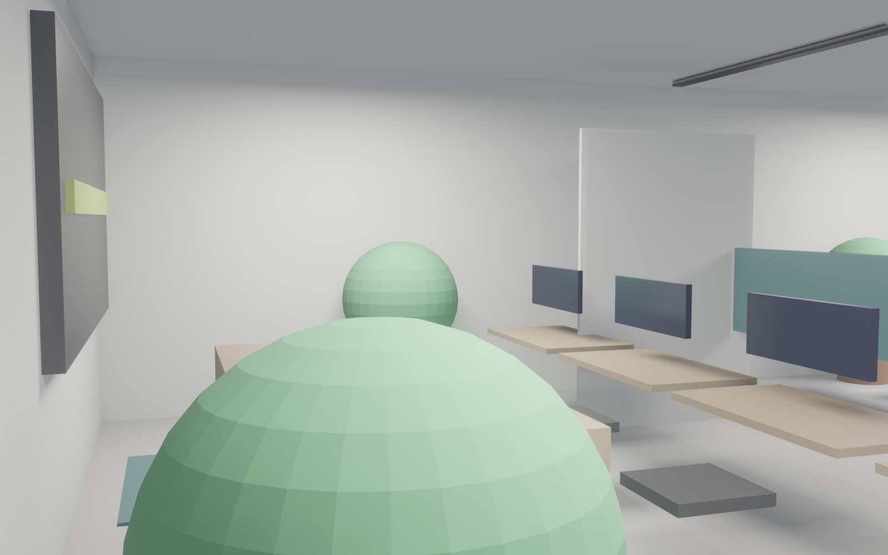

<!-- _class: lead client -->

# Stack Lab
## AI 创业办公室 · 130 m² · v1
### 致敬业主 — 给你的梦想办公室

> 这是我们为一位 AI 创业者设计的梦想办公室
> **made with love by Studio Copilot**

 

| 设计周期 | 方案版本 | 决策点 |
|---|---|---|
| 8 周施工 | v1 | 5 个 |

---

<!-- _class: split client -->

## 第一眼：Tech Loft 的样子
- **风格**：科技感 loft · 外露管道 · 植物丰富
- **参考**：GitHub 办公室 / Stripe HQ / Figma Loft
- **氛围关键词**：tech-loft · plant-rich · code-cave-lite
- **你的团队走进来的感觉**：这是一个让工程师愿意每天来上班的地方

---

<!-- _class: split client -->

## 入口 + LOGO 墙 · 给访客的第一印象
- **LOGO 墙**：背光设计，可拆换（品牌迭代快）
- **接待台 + 等候长凳**：来谈合作的 VC / 客户落座不尴尬
- **品牌色延伸**：deep teal + warm wood 主调
- **决策点**：**LOGO 墙背光颜色**你想要哪种？
  - 🟢 lime green（活力 AI）/ 🔵 deep teal（稳重）/ ⚪ soft white（纯净）

---

<!-- _class: split client -->

## 核心：10 工位开放区
- **10 × 电动升降桌**：站坐切换，久坐工程师必备
- **双屏标配**：20 × 27 寸显示器（显卡开发刚需）
- **人体工学椅**：每人一把好椅子 = 少请病假
- **桌面隔板**：专注和协作之间平衡
- **灯光**：4000 K 线性吸顶 · 不刺眼、不昏暗

---

<!-- _class: split client -->

## GPU 机柜室 · AI 团队的心脏
- **3 × 42U 标准机柜**：容纳主力训练显卡
- **玻璃门 + 蓝色 LED accent**：视觉亮点，访客拍照打卡
- **独立精密空调** + **5 kW 专电**：机器跑满不跳闸
- **决策点**：**机柜室放在哪里**？
  - 🅰 靠墙内嵌（省空间、不占黄金区）
  - 🅱 中心展示（品牌打卡墙、访客必看）

---

<!-- _class: split client -->

## 玻璃会议室 · 10 人 · 4m 白板墙
- **会议桌 2.4m + 10 把椅**：全团队刚好坐下
- **75 寸大屏 + 4m 白板墙**：画架构、推公式无压力
- **玻璃隔断**：开会不憋闷，开放工位也看得见
- **决策点**：**玻璃会议室通透度**？
  - 🟦 **4 面通透**：最开放、最透光、但隐私弱
  - 🟩 **3 面通透 + 1 面实墙**：白板墙更稳、挡背后视线

---

<!-- _class: split client -->

## 休闲沙发吧 + 桌足球 · 电话亭 × 2
- **桌足球**：程序员减压标配，10 分钟放空回血
- **沙发 + 豆袋**：1v1 闲聊、方案评审不一定要坐会议室
- **电话亭 × 2**（1.2 × 1.2 × 2.5 m）：远程会议 / 1v1 不吵人
- **决策点**：**桌足球桌位置**？
  - 🅰 休闲区中心（气氛热烈、但有噪音）
  - 🅱 靠窗角落（低调、不打扰工位）

---

<!-- _class: split client -->

## 平面布局 · 你能看见东西摆在哪
- **入口 + LOGO 墙** → 门口第一眼
- **开放工位 45 m²** → 中央核心区
- **GPU 机柜室 10 m²** → 独立房间 · 隔音制冷
- **玻璃会议室 18 m²** → 靠窗采光最佳
- **茶水间 8 m²** → 紧邻工位 · 快速回血
- **休闲区 + 桌足球 12 m²** → 放松区独立分区
- **绿植区 4 m²** → 点缀整个空间

---

## 5 个决策点 · 请你拍板

| # | 决策 | 选项 |
|---|---|---|
| 1 | **GPU 机柜室位置** | 🅰 靠墙内嵌 / 🅱 中心展示 |
| 2 | **玻璃会议室通透度** | 🟦 4 面通透 / 🟩 3 面 + 1 面白板实墙 |
| 3 | **桌足球桌位置** | 🅰 休闲区中心 / 🅱 靠窗角落 |
| 4 | **植物数量与种类** | 🌿 5 盆基础（榕 + 龟背竹）/ 🌴 8 盆丰富（+ 琴叶榕 + 鹤望兰） |
| 5 | **LOGO 墙背光颜色** | 🟢 lime green / 🔵 deep teal / ⚪ soft white |

> 5 个决策勾完 → 我们 5 分钟出新版本渲染图

---

## 预算 ¥750K · 工期 8 周

130
m² loft 改造

10
工程师工位

¥750K
总预算

8
周交付

### 主要花费分项

| 项目 | 占比 | 金额 |
|---|---|---|
| GPU 机柜室（制冷 + 专电 + 机柜） | 20% | ¥150K |
| 10 工位 + 双屏 + 人体工学椅 | 22% | ¥165K |
| 玻璃会议室（隔断 + 大屏 + 白板） | 15% | ¥113K |
| 装修主体（地面 / 管线 / 灯光） | 28% | ¥210K |
| 电话亭 × 2 + 茶水间 + 卫生间 | 10% | ¥75K |
| 家具软装（沙发 / 桌足球 / 植物 / LOGO 墙） | 5% | ¥37K |

---

<!-- _class: lead client -->

# 下一步

> ✅ 方案已就绪 · ⏭ 等你拍 5 个决策

- **勾决策点** → 5 分钟出新版本渲染图
- **微调**（颜色 / 植物数量 / 家具位置）→ 10 分钟
- **确认定稿** → 进入施工图 + BIM + 预算清单

📞 **Studio Copilot Team** · made with love 💚

> 致敬业主 — 愿 Stack Lab 成为你 AI 梦想起飞的地方
