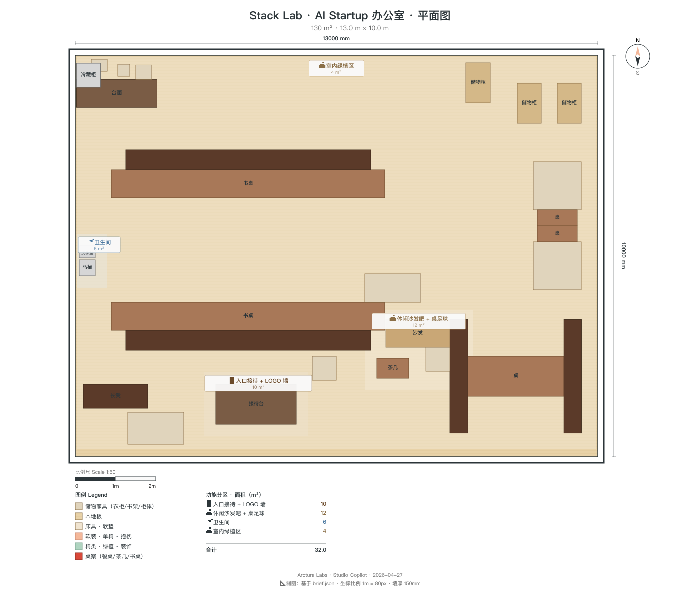

<!-- _class: lead contractor -->

# Stack Lab · AI 创业办公室
## 施工交付包 · 130 m² Loft 改造
### 给总包 / 项目经理

 

| 工期 | 预算 | 交付文件 |
|---|---|---|
| 8 weeks | ¥750,000 | DXF + IFC4 + 本 PPT |

---

<!-- _class: split contractor -->

## 平面图 · 带分区标注

- **尺寸**：13.0 × 10.0 × 3.0 m / 净高 3.0 m
- **9 个分区**：接待 / 10 工位 / GPU 机柜 / 玻璃会议 / 电话亭×2 / 茶水 / 休闲吧 / 卫生间 / 绿植
- **出入口**：独立入口 · 从东北角进入
- **原始状态**：毛坯 loft · 外露管道 · 独立水电接入
- **比例**：1:80 · 可 AutoCAD / Rhino / QCAD 直接打开

---

<!-- _class: split contractor -->

## DXF 文件交付说明

- **图层**：墙体 / 隔断 / 家具 / 强电 / 弱电 / 照明 / 暖通 分层
- **实体数**：~95 个 · 所有隔墙含厚度
- **标注**：所有关键尺寸 + 分区面积 + 门窗位置
- **坐标**：(0,0) 位于平面左下角 · 单位 mm
- **配套 IFC4**：含 BIM 体量，供机电深化设计接口

---

## BOQ 主项汇总 · ¥750,000

| 区 | 项目 | 数量 | 单价 ¥ | 小计 ¥ |
|---|---|---|---|---|
| 接待 | LOGO 墙（钢架+磁吸面板可拆换）| 1 项 | 18,000 | 18,000 |
| 工位区 | 电动升降桌 1.4×0.7 m | 10 张 | 3,800 | 38,000 |
| 工位区 | 人体工学椅 | 10 把 | 2,500 | 25,000 |
| 工位区 | 27" 显示器 | 20 台 | 2,200 | 44,000 |
| **GPU 室** | **42U 标准机柜 + 精密空调 + 5 kW 专电** | **1 套** | **120,000** | **120,000** |
| 会议室 | 4 面通透玻璃隔断（含地面密封）| 1 项 | 85,000 | 85,000 |
| 会议室 | 75" 大屏 + 4 m 白板墙 | 1 套 | 28,000 | 28,000 |
| 电话亭 | 整体定制 1.2×1.2×2.5 | 2 个 | 22,000 | 44,000 |
| 茶水/休闲 | 台面+柜+沙发+桌足球 | 1 套 | 55,000 | 55,000 |
| 机电 | 强弱电 + 照明 + 暖通 | 1 项 | 140,000 | 140,000 |
| 暴露管道 | 喷涂处理 + 吊挂整理 | 1 项 | 18,000 | 18,000 |
| 绿植/软装 | 5 大盆栽 + 豆袋 + 装饰 | 1 套 | 15,000 | 15,000 |
| 人工+管理费+税费 | | | | 120,000 |
| **合计** | | | | **¥750,000** |

---

<!-- _class: split contractor -->

## 关键节点 1 · GPU 机柜室（重点）

- **面积**：10 m² · 3 × 42U 标准机柜
- **专电**：5 kW 独立回路 · 三相 380V 预留 · UPS 接口位
- **精密空调**：1 台 3.5 kW 下送风 · 温控 22±2 ℃ · 湿度 45±10 %
- **玻璃观察门**：单开 900×2100 · 12 mm 钢化 · 密封条 · 磁吸锁
- **地面**：抗静电 PVC 卷材 · 防静电接地
- **消防**：七氟丙烷预留接口（后期可扩）
- **弱电**：机柜顶部 1 m 桥架 · 预留 48 口光纤配线
- **验收**：带载 72h 不跳闸 / 温控稳定 / 噪音 ≤ 55 dB @ 1m

---

<!-- _class: split contractor -->

## 关键节点 2 · 玻璃会议室 4 面通透

- **与 04 差异**：4 面全玻璃（vs 04 单面）→ 结构独立成型
- **玻璃**：12+12A+12 双层中空钢化 · STC 38 · 4 片 L 型拼接
- **边框**：6061 铝合金 80×50 mm 主框 · 氟碳喷涂 deep_teal
- **拼缝**：4 竖缝用结构密封胶 + 遮蔽铝条 · 地面槽 U 型收口
- **防夹手**：门边 + 合页位加缓冲条 · 自闭阻尼器 3 s 延迟
- **地面**：5 mm 软木缓冲 + 声学隔离垫
- **门**：双开玻璃 1800×2100 · 磁吸 + 闭门器
- **顶部**：天花留 100 mm 悬浮缝（通风 + 避免结构硬接）

---

<!-- _class: split contractor -->

## 关键节点 3 · 电话亭 ×2

- **外尺寸**：1200 × 1200 × 2500 mm
- **墙体**：50 mm 吸音棉 + 12 mm 石膏板×内外两层 + 5 mm 阻尼层
- **门**：800×2100 · 内开 · 磁吸密封条 · 自闭
- **通风**：顶部静音风扇 80 CFM · 噪音 ≤ 28 dB
- **照明**：内置 12W LED 面板 4000K · 人体感应
- **桌面**：500 × 350 × 740 h · 皮革垫 + USB-C Hub 预埋
- **实测验收**：门内外声压差 ≥ 25 dB

---

## 暴露管道处理方案

| 管道类型 | 处理方式 | 视线管理 |
|---|---|---|
| 上水 PPR 主管 | 保留 · 喷涂 charcoal #2A2A2C | 工位区上方保留（tech-loft 风格）|
| 下水 PVC | 重排 · 沿北墙走 · 封吊顶 | 会议室 / 电话亭区域隐藏 |
| 暖通风管 | 保留 · 喷涂 concrete_gray | 全区可见 |
| 强电桥架 | 新增 · 镀锌钢格 · 走工位区中央主轴 | LOGO 墙和 GPU 室段隐藏吊顶 |
| 弱电线槽 | 新增 · 沿桥架同路由 | 同上 |

**原则**：工位区/休闲区暴露（氛围）· 接待/会议/GPU 室隐藏（专业感）

---

## LOGO 墙可拆换节点

- **尺寸**：2400 × 2400 mm · 1.4 m² 展示面
- **基础**：墙体预埋 40×40 mm 镀锌方钢龙骨 @ 600
- **面板**：铝塑板 600×600 · 背贴钕铁硼磁铁 ×4
- **安装**：磁吸 + 底部卡扣定位 · 单人 5 分钟更换
- **背光**：LED 灯带沿钢架内框 · 24V 低压 · 独立开关
- **备品**：首批做 2 套面板（品牌 v1 + 空白备用）
- **接口**：预留 1 个国标 5 孔插座 + 1 个 HDMI 入墙（留屏幕升级位）

---

## 10 个电动升降桌 · 强电布局

- **位置**：2 排 × 5 工位 · 背靠背布置 · 中央走线槽
- **每工位**：2 × 国标 5 孔 + 2 × USB-A + 1 × Type-C PD 65W
- **升降桌电源**：地面弹起插座 10 个 · 避让桌脚移动轨迹
- **回路分组**：2 组独立回路 · 每组 5 桌 + 10 屏 · C20 断路器
- **弱电**：每工位 1 × RJ45 Cat6 · 汇聚到 GPU 室交换机
- **插座位置**：参考 DXF `layer_strong_power` 层标注
- **验收**：满载 10 桌同时升降 · 电压波动 ≤ 5 %

---

## 照明清单

| 区域 | 灯具 | 色温 | 数量 |
|---|---|---|---|
| 工位区 | 线性 LED 吸顶 1.2m 40W | 4000K | 12 支 |
| 工位区 | 轨道射灯 15W | 4000K | 20 颗 |
| 会议室 | 线性 LED 吊线 60W | 4000K | 3 支 |
| GPU 室 | 密闭型面板灯 36W | 4000K | 4 盏 |
| 休闲区 | 黄铜吊灯 | 2700K | 3 盏 |
| 茶水间 | LED 筒灯 9W | 3500K | 6 颗 |
| LOGO 墙 | 灯带 24V | 3000K | 1 套 |
| GPU 机柜 | 蓝色 accent LED | — | 1 套 |
| 植物生长灯 | 全光谱 | — | 5 盏 |

---

## 8 周工期 Gantt（比 04 紧张 2 周）

| 周 | 工序 | 关键里程碑 |
|---|---|---|
| W1 | 拆改 + 管道重排 + 强电进场放线 | 毛坯清理完毕 |
| W2 | 砌墙 + GPU 室结构 + 玻璃隔断预埋槽 | 隔墙成型 |
| W3 | 机电预埋（强/弱/暖通）+ 专电回路 | 隐蔽工程报验 |
| W4 | 精密空调就位 + 玻璃隔断安装 | 会议室 4 面玻璃拼装 |
| W5 | 吊顶 + 管道喷涂 + 地面 PVC | 天花完成 |
| W6 | 电话亭进场 + 机柜进场 + LOGO 钢架 | GPU 通电测试 |
| W7 | 家具进场（10 升降桌 + 椅）+ 灯具 | 照明验收 |
| W8 | 软装 + 绿植 + 保洁 + 整体验收 | 交付 |

**风险缓冲**：W4 玻璃拼装 / W6 GPU 专电 是关键路径，提前备料

---

## 验收标准

| 项 | 标准 | 验收方式 |
|---|---|---|
| 墙面平整度 | ≤ 3 mm / 2 m | 2 m 靠尺 |
| 玻璃会议室隔音 | STC ≥ 38 | 声级计实测 |
| 电话亭隔音 | 门内外压差 ≥ 25 dB | 声级计实测 |
| GPU 室温控 | 22 ± 2 ℃ 持续 72 h | 数据记录仪 |
| GPU 专电 | 5 kW 带载 72 h 不跳闸 | 电力仪 |
| 工位照度 | 500 ± 50 lux @ 桌面 | 照度计 |
| 工位插座 | 每工位 2×5 孔 + 2×USB-A + 1×USB-C PD | 逐位通电 |
| 升降桌 | 10 张同时升降 · 电压波动 ≤ 5% | 满载测试 |
| 暖通 | 新风 CFM ≥ 30 m³/h·人 | 风速计 |
| LOGO 墙 | 面板拆换 ≤ 5 分钟 / 单人 | 现场演示 |

---

<!-- _class: lead contractor -->

# 交付文件 + 对接

> 施工包已就绪 · 可直接进场

**交付清单**
- `floorplan.dxf` · AutoCAD 2010+ 可开
- `model.ifc4` · Revit / ArchiCAD 兼容
- 本 PPT（PDF + ODP）
- BOQ 明细 Excel

**对接窗口**
- 设计：Studio Copilot 设计组
- 业主：AI 创业团队 (致敬业主)
- 周会：每周五下午 · 现场 walk-through

📞 问题随时沟通
