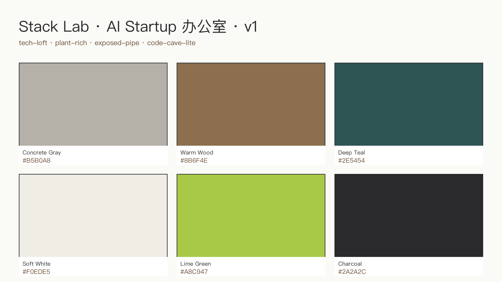

<!-- _class: lead designer -->

# Stack Lab

## AI 创业办公室 130 m² · v1

### 深化设计交付包 · 给设计师同事

<br>

| 风格 | 面板 | 源文件 |
|---|---|---|
| tech-loft · plant-rich · exposed-pipe | 13.0 × 10.0 × 3.0 m | room.json + floorplan.svg + deck.md |

---

<!-- _class: split designer -->


## 俯视彩色平面 · 方案总览

- **面积**：130 m² · Loft 改造 · 毛坯 + 外露管道
- **分区**：9 个功能区（见下方列表）
- **工位**：10 × 双屏电动升降桌
- **核心亮点**：GPU 机柜室 + 玻璃会议室 + 桌足球
- **参考对标**：GitHub / Stripe HQ / Figma Loft

---

## 源文件清单 · 接手即可深化

| 文件 | 用途 | 编辑工具 |
|---|---|---|
| `room.json` | 3D 物体定义（位置/尺寸/材质） | 任意文本编辑器 + blender CLI |
| `floorplan.svg` | 2D 平面图（矢量，可标注） | Inkscape / Illustrator |
| `floorplan.png` | 平面图栅格导出 · 150 dpi | — |
| `brief.json` | 设计 brief（风格/分区/预算） | 任意文本编辑器 |
| `moodboard.json` + `.png` | 配色板 | — |
| `decks/deck-*.md` | Marp 幻灯片（7 种视角） | 任意文本编辑器 |
| `renders/*.png` | 8 张内部/俯视渲染 | blender CLI |
| `exports/*.glb/.obj/.fbx/.ifc` | BIM/3D 导出 | 下游 Revit / Rhino |

---

<!-- _class: split designer -->



## 风格关键词 + Tech-Loft 配色

- **keywords**：tech-loft · plant-rich · exposed-pipe · code-cave-lite
- `concrete_gray  #B5B0A8` — 墙面/管道底漆
- `warm_wood      #8B6F4E` — 地板/工位台面
- `deep_teal      #2E5454` — 会议室主墙/点缀
- `soft_white     #F0EDE5` — 顶面/吊柜
- `lime_green     #A8C947` — 品牌 accent / LOGO 墙
- `charcoal       #2A2A2C` — 机柜 / 金属桁架

---

## 材质 PBR 参数表

```
ConcreteGray : base #B5B0A8, roughness 0.85, metallic 0.00
WarmWood     : base #8B6F4E, roughness 0.55, metallic 0.02
DeepTeal     : base #2E5454, roughness 0.70, metallic 0.00
SoftWhite    : base #F0EDE5, roughness 0.90, metallic 0.00
LimeGreen    : base #A8C947, roughness 0.50, metallic 0.00   # 仅 accent
Charcoal     : base #2A2A2C, roughness 0.35, metallic 0.85   # GPU 机柜/桁架
ExposedPipe  : base #6E6A64, roughness 0.45, metallic 0.70   # 黑化铁 + 半哑光漆
BlueLED      : emission #2B6CFF @ 12 W/m², linear strip
Glass        : base #DCE3DA, roughness 0.05, transmission 0.92
ScreenBlack  : base #000000, roughness 0.20, metallic 0.00
```

---

## 关键尺寸表 · 施工侧对齐

| 区域 | 尺寸 (m) | 数量 | 备注 |
|---|---|---|---|
| 开放工位 | 1.4 × 0.7 × (0.72–1.18 升降) | 10 | 双屏 · 27 寸 × 20 |
| GPU 机柜 | 0.6 × 1.0 × 2.0（42U） | 3 | 5 kW 专电 · 精密空调 |
| GPU 机柜室玻璃门 | 0.9 × 2.1（单扇推拉） | 1 | 10+10A 双层钢化 |
| 玻璃会议室 | 6.0 × 3.0 × 2.7 | 1 | 2.4 m 会议桌 + 10 椅 · 75" 屏 · 4 m 白板 |
| 电话亭 | 1.2 × 1.2 × 2.5 | 2 | 隔音三层复合 |
| 品牌 LOGO 墙 | 3.0 × 2.7（背光） | 1 | 可拆换亚克力面板 |
| 大型盆栽 | Ø 0.6–0.9 × 1.8–2.2 | 5 | 榕树 / 龟背竹 |

---

<!-- _class: split designer -->


## 暴露管道 · 工业 finish 规范

- **底层**：表面除锈 Sa 2.5 · 防锈底漆 1 度
- **面层**：`ExposedPipe` 黑化铁色（#6E6A64）· 半哑光 · 2 度
- **保留元素**：通风主管（Ø 200）· 桥架 · 消防喷淋支管
- **隐藏元素**：强弱电主干（桥架统一走顶 · 黑化桁架托起）
- **桁架**：40 × 40 方管 · 喷涂 Charcoal #2A2A2C
- **节点详图**：待深化 → 管道穿墙处做黑色法兰收口

---

<!-- _class: split designer -->


## 5 大型盆栽 · 生长灯规格

- **品种**：2 × 榕树 (Ficus) · 2 × 龟背竹 (Monstera) · 1 × 琴叶榕
- **土球尺寸**：Ø 0.6–0.9 m · 自重含盆 40–80 kg（楼板荷载复核）
- **生长灯**：全光谱 LED · 悬挂式 · 150 W/棵
- **PAR 强度**：**200–400 µmol/m²/s** @ 冠层高度（日间 10h）
- **色温伪装**：4000 K 主光 + 660 nm 红光占比 25%（不影响工位观感）
- **灌溉**：点滴自动 + 溢流托盘 · 接市政水
- **位置**：工位区 ×2 · 休闲区 ×2 · LOGO 墙侧 ×1

---

## GPU 机柜室 · 玻璃门 + 蓝 LED + 制冷

- **玻璃门**：10+10A 双层钢化推拉 · 0.9 × 2.1 m · 磁吸密封条
- **观察窗**：三面玻璃 · 1.5 m 高 · 下部 0.9 m 砌砖掩藏线槽
- **蓝 LED accent**：
  - 机柜顶部 · 线性条形灯 · 色温 `#2B6CFF` · 12 W/m
  - 地面脚踢线 · RGB 可调 · 默认蓝光模式
- **制冷**：
  - 精密空调 1 台 · 5 kW 制冷量 · 下送风 · 回风走顶
  - 目标：室内 22 ± 2 ℃ · 湿度 40–55%
  - 冷通道封闭 · 机柜正面吸冷 · 背面排热至吊顶回风
- **强电**：5 kW 专电 · 独立 PDU × 3 · UPS 预留位

---

<!-- _class: split designer -->


## 桌足球 + 豆袋 · 减压区

- **位置**：休闲沙发吧内侧 · 12 m² 分区
- **桌足球**：1.4 × 0.76 × 0.9 m · 周边预留 0.8 m 活动半径
- **豆袋**：Ø 0.9 m × 3 个 · warm_wood 色米白麻布面
- **沙发**：3 座 × 2 · L 型布局 · concrete_gray 布面
- **茶几**：Ø 0.7 m · warm_wood 实木 · 防烫面处理
- **地面**：warm_wood 地板 + 2 × 1.5 m 短毛地毯（deep_teal）
- **声学**：顶部吸音板（布艺包裹）· 降低游戏噪音外溢
- **照明**：3500 K 暖光 · 轨道射灯 + 沙发阅读灯

---

## 照明规划 · 全场分区

| 区域 | 主灯 | 色温 | 辅助 |
|---|---|---|---|
| 开放工位 | 线性吸顶 LED 40 W/m | 4000 K | 桌面夹灯（可选） |
| GPU 机柜室 | 面板灯 + 蓝 LED accent | 5000 K + 蓝 | 机柜内设备灯 |
| 玻璃会议室 | 嵌入式面板 4 × 600×600 | 4000 K | 白板墙洗墙灯 |
| 电话亭 | 内置筒灯 × 1 | 3500 K | — |
| 休闲沙发吧 | 轨道射灯 + 吊灯 | 3500 K | 桌足球区桌上灯 |
| 茶水间 | 吊柜下 LED 条 | 4000 K | 台面工作光 |
| LOGO 墙 | 背光 + 洗墙 | 4000 K + lime accent | 可调亮度 |
| 绿植区 | 生长灯 150 W/棵 | 4000 K + 660 nm 红光 | — |
| 接待/过道 | 轨道射灯 | 4000 K | — |

---

## 修改流程 · 源文件 → 交付

```text
  room.json                          (改物体/尺寸/材质)
     │
     ▼
  blender CLI  →  .blend + .glb/.obj/.fbx/.ifc  (BIM 导出)
     │
     ▼
  _render_multi.py  →  renders/*.png  (8 张视角)
     │
     ▼
  decks/deck-*.md  →  scripts/build_pptx.sh  →  .pptx / .pdf

  floorplan.svg  (Inkscape 改)
     │
     ▼
  rsvg-convert -d 150 floorplan.svg -o floorplan.png
```

---

## CLI 工具链 · 快速索引

| 工具 | 用途 | 入口 |
|---|---|---|
| `blender-cli` | room.json → 3D 场景 + 渲染 + BIM 导出 | `CLI-Anything/.claude/skills/blender-cli/` |
| `inkscape-cli` | floorplan.svg → PNG / PDF / DXF | `CLI-Anything/.claude/skills/inkscape-cli/` |
| `libreoffice-cli` | deck.md → .pptx / .odp / .pdf | `CLI-Anything/.claude/skills/libreoffice-cli/` |
| `pascal-cli` | 3D 建筑体块生成 | `CLI-Anything/.claude/skills/pascal-cli/` |
| `marp-deck` | 本 deck 模板 | `CLI-Anything/.claude/skills/marp-deck/` |

---

<!-- _class: lead designer -->

# 下一步 · 你接手哪块？

> 告诉我区域，我把对应源文件片段准备好。

- **GPU 机柜室节点** → 制冷 + 蓝 LED + 玻璃门深化
- **暴露管道 finish** → 管道穿墙法兰节点详图
- **绿植生长灯** → 灯具选型 + 电路图
- **桌足球减压区** → 家具选型 + 声学处理
- **玻璃会议室** → 白板墙 + 75" 屏 + 投影/吊装点位

源文件：`studio-demo/mvp/13-ai-startup-office/`
