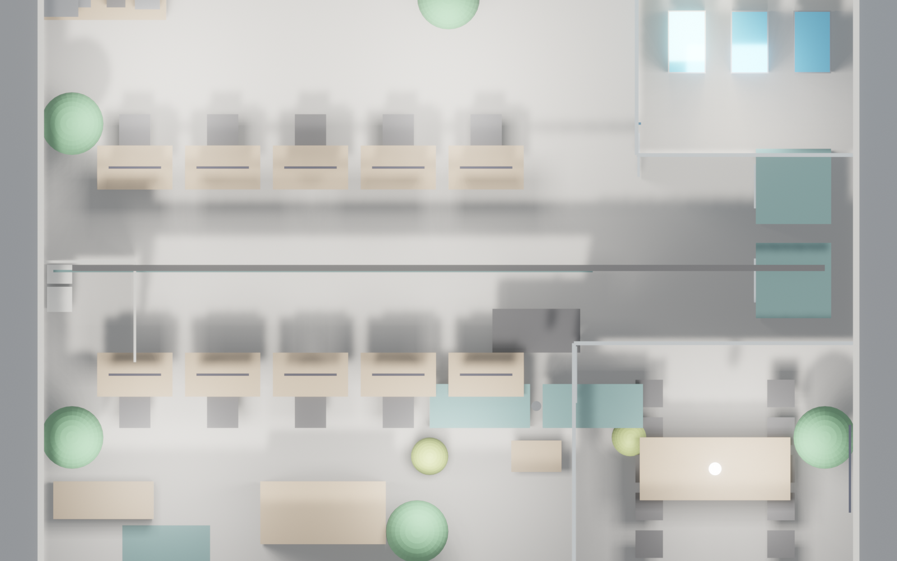

<!-- _class: lead ops -->

# Stack Lab 运营手册
## AI 创业办公室 130 m² · v1 · 自用空间
### 给 运营 / IT / 物业 的日常管理指南

 

| 空间性质 | 团队规模 | 核心风险 |
|---|---|---|
| 自用办公 · 不对外出租 | 10 工程师 | GPU 机柜 · 5 kW 专电 · 植物养护 |

---

<!-- _class: split ops -->

## 空间总览 · 自用不出租
- **定位**：AI 研发工作室，**10 名工程师固定工位**
- **无会员预订系统**：会议室 / 电话亭 / 休闲区全部内部自由使用
- **关键房间**：GPU 机柜室（10 m²）· 玻璃会议室（18 m²）· 开放工位（45 m²）
- **本手册重点**：**GPU 运维 + 植物养护 + 茶水间补给 + 电气安全**
- **不涉及**：会员管理、分时收费、对外预订

---

## 10 员工 Daily Routine · 日常作息

| 时段 | 活动 | 空间 | 运营关注点 |
|---|---|---|---|
| 09:00–09:30 | 到岗 · 刷卡 · 冲咖啡 | 入口 / 茶水间 | 咖啡豆库存检查 |
| 09:30–12:00 | 专注开发 · 双屏编码 | 开放工位 | 空调 24°C · 机柜室温监控 |
| 12:00–13:30 | 午餐 · 桌足球 · 沙发小憩 | 休闲区 / 茶水间 | 冰箱饮品补货 |
| 13:30–17:00 | 会议 / 1v1 / 远程面试 | 会议室 / 电话亭 ×2 | 白板清洁 · 电话亭通风 |
| 17:00–19:00 | 代码评审 · 模型训练监控 | 工位 / 机柜室 | GPU 温度告警阈值 |
| 19:00–22:00 | 加班 / 宵夜 / 豆袋休息 | 全区 | 夜间能耗 · 门禁 |
| 22:00 后 | 无人值守 · GPU 继续训练 | 机柜室 | UPS · 温控 · 远程监控 |

---

## GPU 机柜室 · 关键运维（最高优先级）

| 监控项 | 阈值 | 告警方式 | 处置 |
|---|---|---|---|
| **机柜进风温度** | ≤ 24°C | 短信 + 飞书 | 立即检查精密空调 |
| **机柜出风温度** | ≤ 40°C | 短信 + 飞书 | 降负载 / 开备用空调 |
| **室内湿度** | 40–60% RH | 飞书通知 | 开除湿 / 加湿 |
| **5 kW 专电电流** | ≤ 22 A | 电工告警 | 关停非关键负载 |
| **UPS 电池** | ≥ 80% 容量 | 月度自检 | 季度放电测试 |
| **精密空调** | 24×7 运行 | 故障即停机 | 备用民用空调兜底 |

**巡检频率**：**每日 09:00 + 18:00 目视 + 读数一次**，记录到飞书表格。

---

## 5 大型植物 · 养护 Schedule

| 植物 | 位置 | 浇水频率 | 生长灯 | 备注 |
|---|---|---|---|---|
| 大榕树 #1 | 入口 LOGO 墙旁 | 每周 1 次 · 1.5 L | 无（靠窗） | 每月转盆 |
| 龟背竹 #2 | 开放工位北侧 | 每周 2 次 · 1 L | 全光谱 8 h/天 | 擦叶除尘 |
| 琴叶榕 #3 | 会议室外角 | 每周 1 次 · 2 L | 全光谱 6 h/天 | 避冷风 |
| 天堂鸟 #4 | 休闲沙发吧 | 每周 2 次 · 1.5 L | 全光谱 8 h/天 | 夏季加湿 |
| 散尾葵 #5 | 茶水间旁 | 每周 2 次 · 1 L | 无（靠北窗） | 叶尖发黄即换水 |

**浇水日**：**周二 + 周五 18:00**（由当周值日工程师执行，飞书机器人提醒）。
**生长灯**：定时器 **08:00–16:00** 自动开关 · 年度更换灯管。

---

## 休闲区 · 桌足球 / 豆袋 / 沙发 维保

| 设备 | 维保频率 | 执行 | 费用/年 |
|---|---|---|---|
| **桌足球桌** | 月度：球杆润滑 · 球面除尘 | 值日工程师 | ¥200（配件） |
| | 年度：球杆轴承更换 · 桌面打蜡 | 外包 | ¥800 |
| **豆袋 × 4** | 季度：内胆填充补充 · 外套拆洗 | 清洁阿姨 | ¥600 |
| **3 座沙发 × 2** | 月度：深度吸尘 · 缝隙清理 | 清洁阿姨 | — |
| | 年度：布艺清洗 · 弹簧检查 | 外包 | ¥1200 |
| **茶几** | 每日：桌面擦拭 | 清洁阿姨 | — |

**隐性风险**：豆袋填充塌陷（6 个月必补）· 桌足球小球丢失（常备 10 颗备用）。

---

## 茶水间 · 月度采购清单（10 人消耗）

| 类别 | 明细 | 月用量 | 单价 | 月成本 |
|---|---|---|---|---|
| **咖啡豆** | 精品咖啡豆 | 4 kg | ¥180/kg | ¥720 |
| **茶叶** | 绿茶 / 红茶 / 花茶 | 各 250 g | ¥100/包 | ¥300 |
| **饮料** | 气泡水 / 可乐 / 果汁 | 120 罐 | ¥5/罐 | ¥600 |
| **零食** | 坚果 / 饼干 / 水果 | 10 人 × 30 天 | — | ¥1500 |
| **牛奶 / 燕麦奶** | 1 L × 20 盒 | 20 L | ¥15/L | ¥300 |
| **一次性耗材** | 纸杯 / 咖啡滤纸 / 洗洁精 | — | — | ¥200 |
| **合计** | | | | **¥3620/月** |

**采购节奏**：每月 **1 号 + 15 号** 两次补货（山姆 / 盒马）· 值日工程师轮换下单。

---

## 网络 / IT · GPU 服务器 + 办公网隔离

| 项目 | 配置 | 维保周期 | 负责人 |
|---|---|---|---|
| **办公网** (192.168.1.0/24) | 千兆 · 员工笔电 / 手机 / 会议屏 | 月度巡检 | 内部 IT |
| **服务器网** (10.0.0.0/24) | 万兆 · GPU 机柜 ↔ 工位 · VLAN 隔离 | 月度巡检 | 内部 IT |
| **防火墙** | 双网段 ACL · 仅开发端口互通 | 季度规则审计 | 内部 IT |
| **GPU 服务器** | 3 × 42U 机柜 · Nvidia H100 × N | 季度驱动更新 · 年度硬件维保 | 外包 + 内部 |
| **NAS 备份** | 50 TB · 代码 / 模型 checkpoint | 每日增量 · 每周全量 | 内部 IT |
| **公网带宽** | 500 Mbps 专线 + 1 Gbps 商宽备份 | — | 运营商 |

**关键**：办公网与服务器网**物理隔离**，GPU 机柜仅通过堡垒机 SSH 访问。

---

## 安全 + 电气 · 5 kW 专电系统

| 项目 | 要求 | 检查频率 | 责任人 |
|---|---|---|---|
| **5 kW 专电回路** | 独立空开 · 漏电保护 · 铜芯 6 mm² | **月度**：夹钳表测电流 | 外包电工 |
| **UPS 后备** | 30 分钟 GPU 满载续航 | 季度放电测试 | 内部 IT |
| **烟雾报警器** | 机柜室 ×1 · 公区 ×3 | 月度自检按钮 | 值日工程师 |
| **灭火器** | 气体型 ×1（机柜室）· 干粉 ×2 | 年度换药 | 外包 |
| **消防通道** | 无堆物 · 应急灯常亮 | 每周巡查 | 值日工程师 |
| **门禁 + 监控** | 刷卡进出 · 摄像头 × 4 (入口/机柜/工位/休闲) | 日查录像 · 年度硬件 | 内部 IT |
| **公众责任险 + 财物险** | 设备价值 ≥ ¥300 万 | 年度续保 | 运营 |

**高风险场景**：**夜间无人 GPU 训练**——必须 UPS + 温控 + 远程监控**三重兜底**。

---

<!-- _class: lead ops -->

# 运营仪表盘建议

> ✅ 每日看板 · ⏭ 月度复盘

- **日指标**：GPU 温度峰值 / 5 kW 实时电流 / 空调运行时长
- **周指标**：植物浇水打卡 / 桌足球维保 / 茶水间库存
- **月指标**：总电费 / 采购成本 / UPS 健康度 / 设备折旧
- **年指标**：保险续保 / 空调大保养 / GPU 驱动升级 / 家具翻新

📞 紧急联络：电工 ______ · 空调 ______ · 网络 ______ · 清洁 ______
