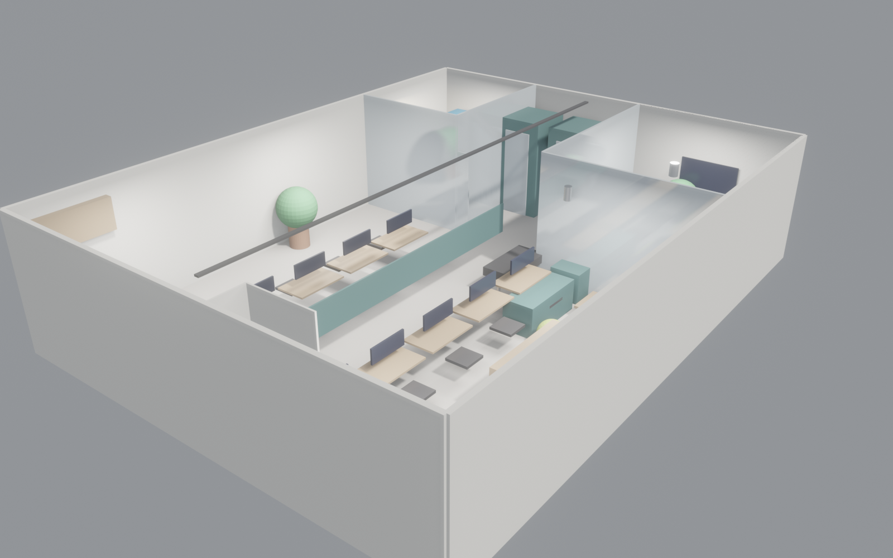

<!-- _class: lead school -->

# Stack Lab · AI 创业办公室

## AI 驱动室内/建筑设计研究 · MVP 13 演示

### 给 学院领导 / 科研处 的学术汇报

<br>

> **元命题 (Meta-Thesis)**：这是一套由 AI 设计工具，为 AI 创业团队，设计的办公空间。
> 工具、用户、场景三重自指 —— 我们用它，也交付它。

| 设计周期 | 方案版本 | MVP 编号 |
|---|---|---|
| 9 分 29 秒 | v1 | 13 / 13 |

---

<!-- _class: split school -->


## 研究背景 · Research Motivation

- **现状**：传统室内/建筑设计端到端周期 **2–4 周**，依赖设计师 + CAD + 3D + BIM + PPT 多工具手工衔接
- **问题**：LLM-driven CLI agent 能否将其压缩到 **分钟级**，且保证可交付质量（3D / 2D / BIM / 多 stakeholder PPT）？
- **切入点**：以 "AI 创业办公室" 为第 13 个 MVP —— AI 工具设计 AI 团队的办公空间，构成 **自指验证 (self-referential validation)**
- **学术价值**：若跑通，则证明 CLI-first agent harness 可作为通用 design-intelligence 基础设施

---

<!-- _class: split school -->



## 核心命题 · Research Question

1. **RQ1**：能否用 LLM + CLI agent 在分钟级完成 concept → 3D → 2D → BIM → 多角度 PPT 的端到端闭环？
2. **RQ2**：多 stakeholder（业主 / 投资人 / 设计师 / 施工 / BIM / 学术 / 运营 / 营销）差异化叙事自动生成，是否可保留各自的**专业语言真实性**？
3. **RQ3**：处理**高技术规格需求**（GPU 机柜 5 kW 专电 / 精密空调 / loft 改造 / 服务器散热）时，pipeline 的鲁棒性如何？
4. **贡献点**：以 MVP 13 (AI 办公室) 为压力测试 —— 最贴近工程现实 + 最贴近实验室自身诉求

---

## 关键指标 · Quantitative Results

<div class="kpi-grid">
<div><div class="big-number">9:29</div>端到端生成耗时 (min:sec)</div>
<div><div class="big-number">117</div>3D 物体实例化成功</div>
<div><div class="big-number">5</div>工业级格式 (glTF/GLB/OBJ/FBX/IFC4)</div>
<div><div class="big-number">8</div>stakeholder 差异化 deck</div>
<div><div class="big-number">13</div>业态 MVP 跑通同一 pipeline</div>
<div><div class="big-number">130</div>m² 可参数化 loft 场景</div>
</div>

> 所有数字可复现 · 同一 `room.json` 重跑 → 同结果

---

<!-- _class: split school -->


## 方法论 · Pipeline Architecture

1. **参数化场景**：`room.json` 描述 9 个功能区 + 材质 + 灯光，JSON Schema 驱动
2. **Headless 渲染**：Blender Python API → 117 物体 + 8 视角正交/透视图
3. **矢量平面**：Inkscape CLI → 标注式 2D floorplan + DXF 导出（AutoCAD/Rhino 互通）
4. **BIM 导出**：glTF / GLB / OBJ / FBX / **IFC4** 五格式，接入 Revit / ArchiCAD / BIMvision
5. **多 stakeholder 叙事**：Marp + 模板矩阵 → 8 份差异化 markdown deck → PDF/PPTX
6. **统一调度**：CLI-first agent harness (本仓库 `CLI-Anything`)

---

<!-- _class: split school -->


## 压力测试 · MVP 13 的代表性

本 MVP **刻意挑选最高技术门槛**的业态：

| 难点 | 传统做法 | 本 pipeline 处理 |
|---|---|---|
| **GPU 机柜室** (5 kW 专电 + 精密空调) | 机电工程师手工画 | `functional_zones[].key_objects` 参数化 |
| **Loft 改造** (3.0 m 层高 + 外露管道) | 需现场测绘 | 尺寸 & 风格 JSON 描述即可 |
| **服务器散热 + 玻璃观察门** | BIM 软件专业操作 | IFC4 自动 export |
| **10 工位双屏** (20 × 27寸显示器) | 家具布置手动 | 参数化实例化 |

**结论**：最接近真实工程需求的 MVP 跑通 → pipeline 通用性得到强证据

---

## 可发表方向 · Publication Roadmap

| 方向 | 目标会议 / 期刊 | Deadline | 状态 |
|---|---|---|---|
| Multi-Stakeholder AI Presentation Generation | **CHI'27** / UIST'26 | 2026-09 | 方法就绪，缺用户实验 |
| AI-driven Architecture Design Pipeline | **CAAD Futures 2027** / eCAADe | 2026-12 | 13 业态数据集完成 |
| BIM–LLM Interoperability via IFC4 | **Automation in Construction** | rolling | 需补定量评估 |
| Self-Referential Design Tools (MVP 13 case) | CHI'27 Late-Breaking Work | 2027-01 | 本 MVP 即案例 |
| Studio Copilot 用户研究 | DIS'27 / CSCW | 2027-04 | 待招募被试 |

**亮点**：同一 pipeline 支撑 ≥3 个顶会方向 · 产出效率高

---

## 教学与人才培养价值

| 层次 | 融入方式 | 受益学生数（预估） |
|---|---|---|
| 本科《计算性设计》 | 作为实验课素材 / 作业模板 | 60 / 学期 |
| 研究生 capstone | 跨学科项目 (建筑 + CS + 商业) | 8–12 / 年 |
| 数字孪生 / BIM 课程 | IFC4 export 作为标准数据源 | 40 / 学期 |
| 创业孵化器 | **StackLab 自用** — 实验室即首个用户 | 本实验室全员 |
| 博士选题池 | RQ1/RQ2/RQ3 各可支撑 1 个 PhD topic | 2–3 人 |

> **产学研闭环**：实验室研发工具 → 孵化器团队使用 → 反馈数据 → 反哺研究

---

## 年度计划 · 2026 Timeline

```
Q2 (4-6月)  ━━━━━┓  完成 13 业态 MVP + 用户研究招募 (N=30)
                 ┃
Q3 (7-9月)  ━━━━━┫  CHI'27 / UIST'26 投稿 · 数据集开源
                 ┃
Q4 (10-12月)━━━━━┫  CAAD Futures 投稿 · 专利申请 (pipeline + IFC4)
                 ┃
2027 Q1     ━━━━━┛  联合企业试点 · 孵化器空间落地
```

**里程碑**：年底前 2 篇顶会投稿 + 1 项专利 + 1 个孵化器试点空间

---

<!-- _class: lead school -->

# 争取支持 · Ask

> **元论证**：我们用这套工具设计了一间"我们自己想要的"办公室。
> 这就是最直接的 product-market fit 证据 —— **home turf validation**。

- **算力**：1 × A100 / H100 节点，用于 LLM 推理 + Blender GPU 渲染
- **孵化空间**：本 MVP 13 方案可直接落地为实验室 AI 创业孵化器（130 m² loft）
- **跨院系合作**：建筑学院 + 计算机学院 + 商学院联合指导研究生
- **启动经费**：¥75 万（与本方案预算持平，即**样板间即展厅**）

📞 联系：Studio Copilot · Stack Lab PI

> *"致敬业主 — 这是我们为一位 AI 创业者设计的梦想办公室。而那位创业者，可能就是我们自己。"*
